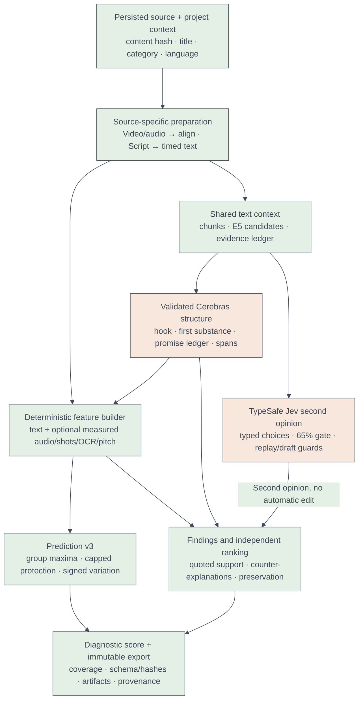
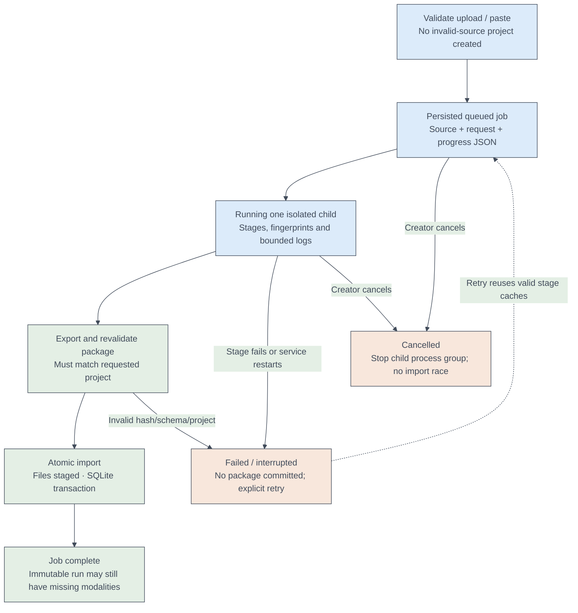
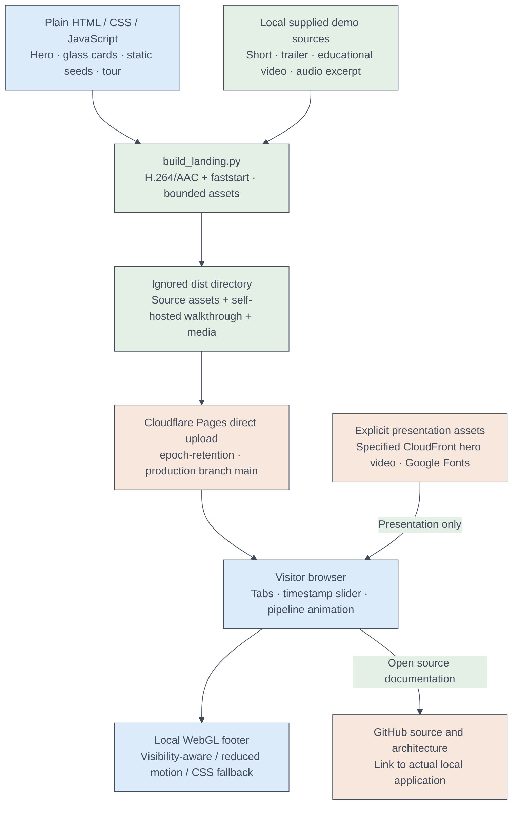

# Epoch architecture — integrated local app and static Cloudflare showcase

**Current snapshot: 2026-10-03.** The detailed current flow/rule inventory is in [README.md](README.md). Sections below retain the implementation decision history; earlier dated validation and UI snapshots are historical. The final integrated architecture is expanded after that history. The hosted showcase is backend-free; the actual analysis API remains local.

The authoritative specifications live in `PLANNER/` (PRD, TRD, Schema, RETENTION_MODEL, COLAB_RUNBOOK). This file describes what was **built**, how data moves through it, and every implementation decision that the planner didn't fix. Each decision is phrased so it can be challenged: *why X rather than Y, and what evidence would reopen it*.

## 1. End-to-end flow

```
                         ┌──────────────────────── this laptop (CPU) ───────────────────────┐
 video.mp4 ──► analyze ─► probe ─► proxy ─► audio ─► video_scan ─► frames ─► asr ─► align ─► visual_job
                         │  (media env)                                     (asr env)        │ *.visualjob.zip
                         └──────────────────────────────────────────────────────────────────┘      │
                                                                                                    ▼
                         ┌────────────── Google Colab (A100, other account) ──────────────┐   Drive upload
                         │ notebooks/epoch_visual_colab.ipynb                               │
                         │  preflight → hashed venv (vlm lock) → pinned snapshot fetch →    │
                         │  epoch_vlm.runner: qualify → 20 s clips → JSON → refinements     │
                         └──────────────────────────────────────── *.visualresult.zip ──────┘
                                                                                                    │
 attach-visual ◄────────────────────────────────────────────────────────────────────────────────────┘
      │ (re-validates every record; rejects FAKE/unpinned models)
      ▼
 finish ─► embed ─► narrative (Cerebras) ─► predict ─► voice* ─► jev ─► score ─► export
 browser upload ─► durable serial job ─► media stages OR script ─► same finish stages
 * voice runs only when source media exists; Jev is an optional TypeSafe cloud second opinion.
                                                                                         │
 outputs ─► outputs/<slug>_<sha8>/ (CSV/TXT/JSON, proxy, colab zip, package copy)         │
                                                                                         ▼
                                   FastAPI importer (validate → staging → one SQLite txn) ─► React review site
```

Commands (all via `.venvs/media/Scripts/python.exe -m pipeline.cli`): `analyze`, `status`, `outputs`, `attach-visual`, `finish`. The API runs as `.venvs/api/Scripts/python.exe -m uvicorn apps.api.main:app --host 127.0.0.1 --port 8765` and serves the built site from `apps/web/dist`.

## 2. Code map

| Path | Role |
|---|---|
| `contracts/` | Pydantic entities (extra=forbid), deterministic IDs (`det_uuid`, `evidence_id`), canonical JSON, fingerprints, and `validate_package`, shared by the exporter **and** the importer. |
| `pipeline/orchestration/` | Settings (.env), workspace layout, content-addressed stage runner, subprocess launcher (below-normal priority), stage graph. |
| `pipeline/media/` | ffmpeg/PyAV measurements: probe, 720p proxy, loudness/clipping/silence/VAD, cuts/black/freeze, PTS-exact frames. |
| `pipeline/speech/` | Chunked, checkpointed faster-whisper ASR (CPU FP32) and WhisperX alignment. |
| `pipeline/text_vision/` | PaddleOCR text tracks. **Opt-in only** (D18). |
| `pipeline/visual/` | Builds the Colab job (clip plan, frames, prompt, runtime, lock) and imports the result. |
| `epoch_vlm/` | Self-contained Colab runtime shipped inside the job zip (stdlib preflight, hashed fetch, Qwen backend, runner). |
| `pipeline/reasoning/` | Transcript chunks + embeddings, Cerebras client, candidate/evidence book, narrative stage. |
| `pipeline/scoring/` | RETENTION_MODEL formulas: risk bins, coverage bounds, survival scenario, exact AVD. |
| `pipeline/package_export.py` | Assembles and self-validates the immutable `.retention.zip`. |
| `pipeline/outputs.py` | Human-readable copies in `outputs/` (not hidden). |
| `apps/api/` | SQLite schema, importer, REST API under `/api/v1`. |
| `apps/web/` | React 19 + Vite review UI: player, transcript, findings, risk lanes, retention scenario, provenance. |
| `prompts/` | Versioned VLM and narrative prompts (part of the stage fingerprints). |
| `locks/`, `requirements/` | Hashed uv locks per isolated environment. |

## 3. Stage runner contract

* Each stage writes to `work/<asset16>/stages/<name>/<fp16>/`. Its fingerprint = stage name + version + schema version + config + extra inputs + lock digest + the output digests of its dependencies. Changing any of these produces a new directory, and the old output is never mutated.
* Work happens in `<fp16>.partial/`, which is atomically renamed on success. Unit-level checkpoints (ASR chunks, VLM clips) survive crashes, so `--retry-partial` resumes from them.
* `current.json` points at the accepted output, and `journal.jsonl` records every attempt.
* Heavy stages run in their own interpreter (`run_subprocess`, `BELOW_NORMAL_PRIORITY_CLASS`), so process exit frees RAM/VRAM and the laptop stays responsive.

## 4. Environments

| env | key pins | used by |
|---|---|---|
| media | av 15.1, scenedetect 0.7.1, opencv 4.11, imageio-ffmpeg 0.6 (ffmpeg 7.1), httpx, pydantic 2.12.5 | CLI, media, visual job/import, reasoning (HTTP), scoring, export |
| asr | torch 2.8 CPU, whisperx 3.8.6, faster-whisper 1.2.1, ctranslate2 4.6, transformers 4.57.6, sentence-transformers 5.1.2, setuptools<81 | asr, align, embed |
| ocr | paddle 3.3.1, paddleocr 3.7 | ocr (opt-in) |
| api | fastapi 0.135.1, sqlalchemy 2.0.48, uvicorn | importer + API |
| vlm | torch 2.8 cu126, transformers 5.7.0, hub 1.5, accelerate 1.10.1 (linux) | Colab only |
| vlmtest | Windows twin of vlm + pytest | `tests/test_vlm_codepath.py` |

## 5. Data invariants

* **Time zero** = container start (ffmpeg origin), and all intervals are half-open `[start_ms, end_ms)`. Frames are addressed by exact PTS, never `index / avg_fps`.
* Record IDs derive from stable keys. Stage caching reuses matching fingerprints; package provenance/runtime metadata may change bytes across runs. Idempotent import refers to identical package bytes, not all reruns.
* Evidence is a ledger. Issues reference `E##` evidence and never invent times. The narrative LLM picks among candidate intervals (`O#` options) that the pipeline computed, and quotes must be exact transcript substrings.
* Missing analysis is **unknown**, not healthy. Coverage records drive the lower/upper risk bounds, and the scenario shows a central curve only when coverage is complete.

## 6. Visual stage (Colab)

* Clips are 20 s with ±2 s of context, carrying ≤32 frames at 448 px. A final tail shorter than 2 s merges into the previous clip. The input token cap is 12288, max_new_tokens is 768, decoding is greedy, and `enable_thinking=False`.
* Failure policy:
  * one JSON repair
  * on OOM, retry at half the frames and a 6144-token cap
  * stop if >20% of clips fail or OOM happens twice
* **Qualification before the run:** a worst-case clip, then 3 warm repeats checking for memory leaks, requiring ≥2 GiB of headroom. A placement verifier aborts if any parameter is off-device or if <90% of parameters are bf16. FP32 parameters are recorded.
* Checkpoints are mirrored to Drive after every clip, so a disconnected runtime resumes.
* Measured on the real 9B processor (CPU test, tiny random weights): prompt tokens min 5147 / median 5782 / max 11851, all under the 12288 cap.
* Not testable without an A100: real weight load time, true VRAM, and 9B JSON quality. Qualification gates exactly these, on the first minutes of the Colab run.

## 7. Reasoning and scoring

* Cerebras via `httpx`. A probe selects the model (currently `gpt-oss-120b`). Output uses a strict `json_schema`, gets 2 retries within a 45 s deadline, and is never retried on 401/403. The key lives only in `.env`.
* Two passes:
  1. Structure: chapters, hook, first substance, title promises.
  2. Adjudication of pre-built candidates: accept or reject, with severity, explanation, counter-explanation and suggestions.
* Validators drop anything citing unknown evidence or non-substring quotes.
* Scoring follows `PLANNER/RETENTION_MODEL.md`: 5 s bins; severity × evidence weight × overlap; the max per cause group/track; coverage-bounded combination; a survival hazard against an assumed baseline; exact AVD integration. Golden fixtures pin the numbers.

## 8. Package and website

* The exporter writes `manifest.json` plus JSONL tables plus the proxy/frames, then runs `validate_package` on its own output.
* The importer runs the same validator, then:
  * unpacks into staging
  * renames into place
  * inserts in one transaction
* Duplicate bytes return the existing run. The same run_id with different bytes is rejected.
* The site renders packaged diagnostics. The server computes lexical transcript relations on request and can recompute predictions, scenarios and hypothetical comparisons using explicitly acknowledged assumptions.

Local Mac run, 2026-10-03: export version 6 also preserves public stage diagnostics, all sampled JPEGs, extracted WAV, the original MP4, the Colab job ZIP, OCR qualification and readable CSV/subtitle/text reports. These files are listed and hashed in the manifest; they belong to the imported immutable run. The Review **Outputs** tab lists them with bounded text previews and media previews, individual downloads and a downloadable retention package. Download routes resolve manifest artifact IDs within the run directory, rather than accepting filesystem paths. Internal subprocess arguments and logs are excluded. WAV/job ZIP entries are restricted to their named diagnostic paths; nested job ZIPs are downloaded, never recursively extracted by the importer.

On macOS, stage fingerprints and exported lock provenance use the installed `locks/*.mac.txt` when present. The API supplies the platform's pipeline command to New analysis. `predict` is included in CLI and API status lists.

## 9. Decision log (implementation-level)

Planner decisions D01–D15 are in `PLANNER/DesignDecisions.md`, which also carries D16–D18 below.

| ID | Decision | Why not the alternative? | Reopen if… |
|---|---|---|---|
| D16 | Everything except the VLM runs on this laptop. Colab does only visual inference. | Colab sessions are ephemeral and on another account; moving ASR there would double the fragile surface. CPU FP32 ASR is slow (RTF ≈2–3.5) but deterministic and resumable. | A video >15 min makes local ASR exceed ~1 h, or a local GPU becomes available. |
| D17 | Default VLM profile is Qwen3.5-9B BF16; 27B only by explicit opt-in. | 27B BF16 needs ~54 GB of weights plus activations; on a 40 GB A100 it can't run unquantized, and quantization violates D05. 9B leaves headroom for 32-frame clips. | Colab reliably allocates 80 GB A100/H100 **and** the 9B fails the frozen clip rubric. |
| D18 | OCR is opt-in (`--with-ocr`). Without it, the text track's coverage is limited to VLM-observed windows and labelled as such. | CPU PaddleOCR took ~85 min/video and, run alongside Whisper, exhausted RAM and crashed the laptop. The GPU Paddle index was unreachable. | A faster OCR (e.g. RapidOCR/ONNX) meets <10 min on CPU, verified on the bilingual probe. |
| R1 | The media lock pins one opencv distribution. | Two opencv wheels overwrite each other's `cv2` and break silently. | — |
| R2 | The asr env pins `setuptools<81`. | ctranslate2 imports `pkg_resources`, which setuptools 81 removed. | ctranslate2 drops the import. |
| R-01 | `Artifact.bytes ≥ 0` (was > 0). | An honest empty JSONL (e.g. no aligned words) is valid output; forcing >0 would make the exporter lie or fail. | — |
| P-01 | Placement verifier: abort if any param is off-device or <90% bf16; record FP32 params instead of aborting on them. | Qwen keeps some norms/rotary buffers in FP32 by design. Aborting on any FP32 param rejected a correct model, and ignoring it would hide CPU offload. | A model legitimately needs >10% non-bf16 params. |
| T-01 | Time zero = container start, not first video PTS. | Audio and video can start at different PTS. One origin keeps transcript and frames aligned. | — |
| C-01 | A final clip tail <2 s merges into the previous clip; longer tails stay a shortened clip. | A sub-2 s clip has 1–2 frames, too little for any visual claim, yet still costs a full model call. Merging longer tails would push clips past the 20 s/32-frame budget. | Clip-level recall drops at video ends. |
| N-01 | An `unresolved_promise` interval spans from the promise's setup to the end of the video; evidence = the setup window + the final 60 s; the suggested fix rewrites the closing chunk. | Absence has no single timestamp. The honest claim is "from here on, this was never paid", and the ending is where the fix belongs. | Reviewers find the long interval inflates risk across the whole video. |
| S-01 | Technical-track coverage = 1.0 when both the decode/visual checks and the waveform checks ran, 0.5 when audio is missing. | Half-measured is neither unknown nor complete; a half weight keeps the bounds honest instead of claiming the track is clean. | Per-detector coverage becomes available. |
| X-01 | `run_id = det_uuid("run", export fingerprint)`. | Same inputs → same run, so re-imports are idempotent. Different inputs → a new run, never an overwrite. | — |
| N-02 | Payoff time = first paragraph that delivers on a title promise (partial or full), not the final summary. Same-type, same-interval candidates merge into one. | The first real run flagged "payoff at 13:29" three times because the LLM cited the closing recap as fulfilment. | Reviewers see real late payoffs being missed. |
| N-03 | A no-speech gap is dead air only if ≥60% of its RMS windows are below max(−45 dBFS, speech median − 20 dB). | A 25 s played clip at speech loudness was reported as "dead air". | Quiet-but-intentional beats get missed. |
| N-04 | Cerebras 429s are waited out at stage level (≤120 s each, ≤300 s total); the per-call 45 s deadline is unchanged. Invalid candidates/spans are salvaged per item, not per batch. | Free-tier Retry-After was ~50 s; one bad quote had discarded 4 batch-mates. | Paid tier removes the limits. |
| N-05 | `finish` stops at the first failed stage. | Later stages would otherwise reuse the failed stage's last *good* output and present a stale package as current. | — |
| N-06 | Narrative prompt v2: title obligations come from the title words alone; visuals described only as far as the evidence states. Open reopen trigger: the adjudicator accepted 11/11 candidates (0 dismissals) on the test video. | v1 invented a "step-by-step guide" promise and claimed "no visual information" without visual evidence. | Dismiss rate stays at 0 across videos, which means adjudication isn't discriminating. |
| E-01 | **Edits must not destroy content.** (a) Repetition needs ≥2 consecutive sentences whose content-word trigrams mostly (≥50%) occur in the earlier passage; only those sentences are editable. (b) Edit boundaries snap to sentence ends via word times. (c) The slow-intro edit never touches the hook. (d) No cut over speech for a visual fault. (e) Tangent needs a title-relevance outlier (>2.5 MAD below median) and its rewrite only bridges the first sentence. (f) An accepted rewrite must keep ≥40% of the original's content words; otherwise the finding stays and the edit is dropped ("no safe edit"). | The user caught a rewrite that replaced a 35 s passage, including its transition to the next section, with one line. Measured: sentence embeddings scored same-topic and repeated sentences alike (~0.85), and 30/31 "repetition" pairs had zero repeated wording. Segment boundaries split sentences. | Paraphrased repetition (same idea, new words) is now out of scope for edits; reopen if reviewers miss it. |
| R-02 | `Issue.suggested_edit_ids` may be empty. | A diagnosis without a safe edit beats a destructive edit or an edit the model didn't choose. | — |
| W-01 | Website risk lanes hatch the unknown fraction of each bin instead of colouring it green. | A track with no evidence must not look healthy (PRD). | — |
| A-01 | Before alignment, drop ASR segments with >10 words/s over ≥6 words (Whisper repetition loops). Each drop is listed in `transcript.json → dropped_segments` and `outputs/…/07_transcript_dropped.csv`. Repeated text at a normal rate is **never** dropped. | On the test video, faster-whisper emitted 3 loops (10 segments, up to 417 words/s). Real speech measured 3.6 words/s median, 4.8 at p90. Left in, the loops would surface as a false `unnecessary_repetition` against the creator. A text-similarity de-dup would also erase genuine repetition, which is the very defect we detect. Validation: after the guard, 2790/2790 remaining words aligned, versus 2790/2986 before; every unaligned word was loop text. | A real speaker exceeds 10 words/s (e.g. auctioneer-style content), or loops appear at plausible rates (then add a decode-time `hallucination_silence_threshold` and re-run ASR). |
| W-02 | Evidence for a **visual** signal (freeze/black) returns the sampled stills inside its interval (≤8, evenly spaced), or the nearest still. | A reviewer can't judge a "frozen picture" claim from numbers alone. Frames are the cheapest proof already in the package. | Packages start carrying dedicated per-finding thumbnails. |
| M-01 | Text retention model v1 is rule-based proportional hazards: `h(t)=h0(t)·exp(Σ w·x(t))`, where h0 is piecewise constant so that a feature-free video hits S(30 s) and S(T) exactly. The band scales all weights ×0.5/×1.5. Attribution splits the per-second excess loss over neutral in proportion to the positive features. `calibrated: false` is pinned in the contract. | The owner has no retention data yet. Transparent priors with a sensitivity band are honest; any "fitted" model would be invented. Anchors make the result relative to an assumed average video that the user can change. | Real audience curves are available (fit the weights; then drop the band heuristic for a real interval). |
| M-02 | Predictor repetition needs ≥2 consecutive segments with ≥50% content-trigram overlap with earlier text. Low novelty is windowed (20 s, <0.6× median, ≥10 s runs). | Per-sentence rules flagged signpost phrases and single re-quoted lines as drop points. | Reviewers find real repetition the rule misses. |
| X-02 | `predictions.jsonl` is OPTIONAL in package validation. Exported scenario ids are scoped per run. | Old packages must keep importing. The cached score stage reused one scenario id across two runs, and the website's global primary key rejected the second import. | — |
| E-02 | A repeated passage that the speaker announces as a replay ("see if you can spot them in the hook to this video", "watch it again", "here's my hook") is neither a repetition finding nor a predictor repetition feature. | Hand validation: the only repetition cut on the test video (5:45-6:08) removed the intro replay that the next minute analyses. | A real padding repeat is excused because it happens to sit near a cue phrase. |
| M-03 | Predictor setup penalty runs from the hook's end to the first substance, not from 0. | The hook (0:00-0:10) was being penalised as "setup". | — |
| N-07 | Clipping findings say "not verified audible". | 0.1-0.44 % clipped samples on a -14 LUFS master is typical limiter clipping; the LLM had called it "audible distortion". | A listening check or a perceptual clipping metric exists. |
| T-02 | Transcript relations (`pipeline/reasoning/relations.py`) are deterministic and computed on request by the API. Sentence-based measures are off where ASR lost punctuation and casing. | They are cheap, need no rerun, and every item is checkable. Whisper returned 426 s of unpunctuated text on the test video; glueing it would have produced one 7-minute "sentence". | Relations need to feed the predictor (then make them a stage). |
| C-02 | The assistant (`POST /runs/{id}/chat`) answers from a context of transcript, findings, prediction, relations, hook and setup. Quotes are verified against the transcript; out-of-range citations are dropped; edit proposals that touch a question, the hook, a transition or a quoted clip get a server-side warning. | Hand validation: the first answers proposed replacing the hook question and called the intro "filler-heavy" without any measurement. | — |
| A-02 | `transcribe` wraps audio-only input in an MKV with a blank 2 fps picture so the same validated probe, audio, ASR and alignment stages run. | One path, no separate audio code to drift. | — |
| A-03 | ASR `condition_on_previous_text=False` (was True). | On the test video, large-v3 drifted into unpunctuated lower case for whole 5-minute chunks (426 s). The same 90 s decoded fresh was fully punctuated; an initial prompt made it worse (21 vs 46 punctuated words); no conditioning matched baseline and was faster (`scripts/asr_punct_experiment.py`). | The full re-run still shows drift, or loops increase. |
| R-03 | Assistant retrieval = BM25 over 3-segment passages (stride 1) with tiny synonym and number-word normalisation (`pipeline/reasoning/rag.py`); the chat context is chapters + the opening 30 s + the top-8 passages, not the whole transcript. `GET /runs/{id}/search` exposes the same index. | No embedding model in the API env; one video's transcript is small; lexical matches are explainable (matched words are shown). Smoke test hit@3 10/10, hit@1 8/10. | Videos get long or questions get abstract (then add the embed stage's vectors to the package and do hybrid retrieval). |
| U-01 | Review layout: video + "At this moment" panel, full-width timeline, three priority cards, tabs below; evidence, the findings list and the assistant share one right-hand drawer, closed by default. One primary action per screen. | Owner design guidelines: within 3 s the next step is visible, within one click the evidence. The old page showed six panels at once. | — |

## 10. Known open items

* Script-only mode is implemented through browser uploads/paste; validation of editorial quality remains open.
* RapidOCR swap for D18.
* Frames-stage hash mismatch seen once after a crash: the cache verifier rebuilt the stage correctly, but the root cause is unexplained (suspect: a partial write before the crash, then a stale `current.json`).

Mac OCR export correction (2026-10-03): identical text at one timestamp may appear in several screen positions. OCR track IDs include the deterministic track index so both spatial tracks survive package validation. The real 746-track export and an integration regression with two same-text/same-time tracks passed. Imported package downloads preserve the original validated ZIP bytes to maintain run identity on re-import.


## Analysis and review upgrade (2026-10-03)

Latest local review: http://127.0.0.1:8765/runs/09a2301a-4ebe-59c8-942b-5dc118b3d2d4

Text retention v2 is an exploratory, candidate-driven scenario: grouped mechanisms prevent duplicate penalties; fractional final bins and hazard integrals preserve actual duration. Text review has exact quotes, measurements, counter-explanations, preservation notes, semantic-risk candidates, and a promise ledger. Candidate acceptance is distinct from prediction. Immediate replies, framing/rhetorical questions, concrete similes and sub-five-second opening gaps suppress noisy findings. The example has four provisional text candidates, five scenario moments, and zero validated narrative findings.

`voice` reads PCM waveform pitch through normalized autocorrelation and combines aligned word timing with ten-second summaries. Voice pitch/range is not an emotion or engagement measure; source audio retains RMS, LUFS, silence, peak and clipping measurements. Example: 179.8 overall words/min, 115.1Hz median detected pitch, 7.44s silence. Qwen visual inference remains Colab only.

`jev` uses pinned jev-1.13.0 on the official TypeSafe endpoint, named questions sharing bounded context (12 passages per request, eight-call ceiling), strict probability/ID validation, 0.65 confidence review routing, and identical-request caching. Keys are server-side .env only. Cerebras supplies draft explanations/rewrites separately; shortening requires a verified earlier quotation and a lower word count. The example's earlier shortening opinion was rejected for unsupported duplication and routed to review. Model confidence is not editorial certainty or retention validation.

Chat retrieval now fuses offline multilingual E5 and BM25 over overlapping timed passages; corpus vectors and repeated query scores are cached. One below-normal-priority ASR subprocess runs at a time within the API encoder lock; six CPU threads. Cold model startup remains about 6–9s, and lexical fallback is explicit. Actual paraphrase/chat retrieval returned hybrid_e5_bm25 and a verified transcript quotation. It is not a broad retrieval benchmark.

Review defaults to Overview, with Text, Voice and Audio deep dives, cumulative assumed watch seconds, retention/baseline/sensitivity, lexical-risk, rate/pitch/variation/voicing, RMS and LUFS charts. Charts seek the player, preserve unknown gaps, and label assumptions. Text supports a selected-passage Jev question. Outputs includes the new diagnostics and readable reports; final run has 466 artifacts. API compatibility handles fractional timestamps and optional old-package diagnostics.

Validation: 67 media/pipeline tests plus six API tests passed; production frontend build and package self-validation passed; live API, semantic chat, selected Jev and browser chart rendering checked. Local server stays on port 8765. User PLANNER edits are preserved. Nothing committed or pushed. Retention calibration, editorial accuracy evaluation and visual Colab analysis remain outstanding.


## Final browser integration (2026-10-03)

`apps/api/analysis.py` implements `/api/v1/analyses`, `/analyses/text`, `/jobs` and job cancellation before SPA routing. Sources and atomic job state persist under the local app data directory. A single queue launches `pipeline.analysis_job` in the media environment at reduced priority, with six ASR threads. Cancellation kills the child process group; shutdown marks jobs interrupted and stops workers. Completed output must pass the package validator and match the requested project before immutable import.

Scripts flow through `pipeline/script/stage.py` into embeddings, narrative, prediction, optional Jev, scoring and export. TXT/MD timing is explicitly estimated at 150 WPM; SRT/VTT cues are retained, with no invented word alignment. Export v9 produces a validated script asset with text coverage and unknown unmeasured modalities. Audio wraps a blank playback picture, omits video scans and frames, and feeds measured waveform/speech stages into the shared finish flow. Identical media in separate projects receives a project-scoped workspace to avoid importing a package into the wrong project.

| ID | Decision | Reason / limit |
|---|---|---|
| J-01 | One durable, serial browser analysis worker; no silent restart of interrupted jobs. | Bounds CPU pressure and avoids repeating cloud calls without a retry action. Designed for one local API process. |
| J-02 | Validate the output package and project identity before import. | The frontend cannot turn a partial or mismatched worker result into persistent run data. |
| J-03 | Script-only results retain cue/estimated timing and exclude measured media features. | Text does not provide speech rate, voice, waveform or shot evidence. |

Current evidence, run IDs and limits: [final verification report](docs/FINAL_INTEGRATION_2026-10-03.md).


## 10. Final integrated module architecture

The current app separates source preparation, evidence construction, optional model judgments, deterministic analysis and immutable review. Source-level authority belongs to contracts/validators. The knowledge graph is an orientation aid; source/tests decide behavior when the graph is stale or empty.



### Implementation ownership

| Module | Inputs | Outputs / authority |
|---|---|---|
| `apps/api/analysis.py` | Multipart/pasted source and typed project metadata | Durable job UUID, progress, process lifecycle; validates before import |
| `pipeline/analysis_job.py` | Persisted request | Serial source-specific stages + shared finish, result package/workspace |
| `pipeline/orchestration/workspace.py` | Source SHA and project | Project-scoped source registration and stage selection |
| `pipeline/orchestration/stage.py` | StageSpec + upstream records | Fingerprints, journal, output digest, partial checkpoints and errors |
| `pipeline/orchestration/settings.py` | Environment/.env and platform | Isolated interpreter, data/model root and correct lock selection |
| `pipeline/media/probe.py`, `proxy.py` | Source container | Actual timing/rotation/stream metadata and verified playback mapping |
| `pipeline/media/audio.py` | Extracted audio | RMS/silence/loudness/peak/clipping measurements |
| `pipeline/media/video_scan.py`, `frames.py` | Decoded PTS frames | Cuts, shots, diagnostics and sampled evidence grid |
| `pipeline/speech/asr_stage.py`, `align_stage.py` | Waveform and pinned snapshots | Transcript/VAD; scored word times or honest nulls |
| `pipeline/script/parse.py`, `stage.py` | UTF-8 text/subtitle cues | Estimated/supplied segment timeline, no fake alignment or media |
| `pipeline/reasoning/embed_stage.py` and related stages | Timed text | Multilingual passage embeddings and candidates; see graph/source for exact stage helpers |
| `pipeline/reasoning/narrative.py` | Candidate/evidence context | Bounded validated structure and judgments, no arbitrary interval generation |
| `pipeline/reasoning/candidates.py` | Structure + transcript + measured diagnostics | Fixed evidence IDs, affected intervals and legal edit options |
| `pipeline/predict/features.py` | Transcript/structure + optional media | Per-second measured/heuristic feature values |
| `pipeline/predict/model.py` | Features + anchors/shape | Survival, sensitivity, hazards, watch time and same-audience attribution |
| `pipeline/predict/evidence.py`, `risk.py` | Features and text relations | Review candidates, evidence strength, ordinal risk and editorial rank |
| `pipeline/media/voice.py` | Waveform and word times | Ten-second delivery windows and waveform-pitch analytics |
| `pipeline/reasoning/jev.py` | Title, chunks, optional question | Cached typed judgments, gated review routes, guarded draft explanations |
| `pipeline/reasoning/relations.py` | Timed transcript | Lexical answer/definition/abstraction/load/rhythm candidates |
| `pipeline/reasoning/rag.py`, `semantic_retrieval.py` | Query + timed passages | BM25/E5 fused retrieval with explicit lexical fallback |
| `pipeline/scoring/` | Issues + observed coverage | Older diagnostic risk/scenarios and hypothetical cut comparison |
| `pipeline/package_export.py`, `outputs.py` | Finished valid stage records | Self-validated package and readable diagnostics |
| `contracts/`, `apps/api/importer.py` | Export package | Hash/schema/path/reference checks; atomic immutable import |
| `apps/api/main.py` | Run IDs and typed requests | Evidence retrieval, review state, prediction/Jev/chat/output routes |
| `apps/web/src/store.ts` | Focus/seek selections | One player/word/chart/citation selection authority |
| `RetentionBreakdown.tsx` | Packaged/recomputed Prediction | Dedicated survival, pressure, moment attribution, ranked windows and watch time |
| `OcrFrames.tsx` + `/ocr` | Manifest frame references and OCR samples | Selected-still normalised quads with crop/portrait support; not boxes from other samples |
| `apps/landing/` | Static seeds and curated media | Backend-free public showcase, input animation, demo charts and shader footer |

Exact stage helpers can move between modules; the README/source map and current graph narrow their scope. A filename listed here is not evidence that an absent optional feature was run.

## 11. Local job and package state transitions



One API worker process is the deployment assumption. Its thread owns the queue; a lock coordinates cancellation versus commit. API restarts mark interrupted work failed and preserve sources/checkpoints. Automatically resubmitting cloud calls would hide cost and duplicate judgment history, so retry remains explicit. The package can be partial while the job itself is complete because optional coverage is a separate dimension.

### Core record relationships

A Project can have many source-associated Runs. A Run references its Asset, StageRecords, manifest Artifacts, transcript/word records, shots/frames/OCR, narrative signals/promises, Coverage and Issues. Evidence links the exact record/interval/quote to an Issue or observation. Review decisions are mutable local annotations attached to immutable run issue IDs. Prediction/scenario recomputation is a separate acknowledged operation; changing UI assumptions does not alter source media. Edit plans are proposed operations; new media becomes a new run rather than mutating the old package.

Manifest entries name a relative path, artifact identity, bytes, SHA256, kind and producer stage. API downloads are resolved through those entries and bounded under the run root. OCR overlays choose an actual sample frame, use its timestamp, exclude all other sample quads, subtract source crop origin and normalise by crop/source extent. The frontend scales the normalised quadrilateral to the displayed image's actual aspect ratio. This matters for portrait Shorts and resized landscape stills.

## 12. Public static deployment architecture

The public site is intentionally a separate build from the real local React/API app. It contains no analysis endpoint, API credential, remote inference call, user upload or database. The seeded demonstration can be explored with its media samples without needing local model configuration.



The design retains the requested Inter typography, sharp hero controls, painterly mountain-video background and two-pass masked accent. Explicit requested extensions add liquid-glass detail cards, a three-input animated infographic, seeded sample review and a navy/amber procedural landscape footer. No testimonial/pricing/performance claims are invented. Seeds are labelled at the shell, summary, charts, transcripts and downloadable report. Real supplied clips are playable while their illustrative analytical cards remain distinct from actual local pipeline outputs.

Media is prepared outside Git into the ignored deploy folder: H.264 video, AAC audio, `yuv420p`, faststart metadata, bounded resolution and lower-priority two-thread conversion. The audio excerpt is a local 40-second WAV. The original user-provided inputs and full model caches are not pushed. HTTP headers prohibit camera/microphone/location and restrict content sources; no analytics is installed. Fonts and the exact specified hero video still require their external hosts. The footer has a gradient fallback if WebGL is unavailable and respects reduced motion/background visibility. A motion control pauses visual background motion.

A direct upload is manually deployed with Wrangler from the reviewed dist directory. Committing changes to Git alone does not auto-deploy this Pages project. Use the documented build/deploy commands for later updates. The public URL and actual deployment evidence are recorded in the final verification report.

## 13. Qualification boundary

Both new Hindi sources have completed fresh local ASR, alignment, narrative, prediction, voice, Jev, scoring, export and import. All 67 words of the Short and 342 words of the trailer obtained scored alignment in those runs; this is alignment coverage, not measured recognition accuracy. Low-confidence Jev decisions routed to review. No broad Hindi/Hinglish WER or editorial benchmark is available. Genre-specific interpretation remains especially provisional for short promotional/trailer material.

The engine's percentages remain engineering scenarios. The old coverage-bounded multimodal central curve can be unavailable even while v3 has an available-feature scenario. Qwen visual quality remains on hold; new uploads omit OCR and visual AI, and those gaps are visible. Deployment of the static seeded demonstration does not deploy the Python/model backend or qualify audience prediction. Frozen human-reference editorial evaluation, authentic retention curves, hosted authentication, distributed scheduling and automatic rendered editing remain outside the built scope.


## 14. Hosted React workspace

The public Pages bundle now contains both the landing page and `/app/`, the complete React interface built with `VITE_DEMO=true`. `demo/client.ts` resolves data through an allowlisted static manifest instead of `/api/v1`. Direct fetches in DeepDive use this same transport. Player, shot and OCR URLs resolve to prepared public assets; report exports resolve to static JSON/ZIP files. Narrow route rewrites cover New, Review/Plan, Evaluation and Settings without rewriting JavaScript, fonts or sample JSON.

The exporter enumerates only five explicitly supplied public sources. It excludes generic project listing, credentials, raw cloud responses, prompts and logs, and removes local filesystem paths. Settings describe the hosted boundary rather than copying server configuration. Browser review choices remain local. Chat is explicitly local text search, Jev is a saved opinion, and new-source selection opens precomputed examples. The original local build retains the actual upload and API behavior. Browser sensitivity interpolation does not claim equivalence to the Python retention model.
