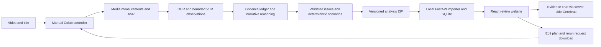

# Technical requirements and integration design

## 1. Architecture and responsibilities

Only the operator transfers files between Colab and local app. The website is usable with cached packages offline. Script-only mode uses the local backend's Cerebras adapter; full Colab analysis can call the same text API through a shared protocol implementation. Each environment gets secrets from its own secret store, never a package. Raw video is not sent to Cerebras; selected transcript and structured observations are. Users are told this at configuration/import review.

No long-running HTTP model server is required in Colab. The notebook is a controller calling stage subprocesses and showing progress. All stage input/output contracts are file-backed and validated. Stage order for a batch maximises reuse: preprocess all assets → ASR/alignment/embeddings for all assets → OCR → VLM for all assets → reasoning/scoring/export. GPU stages run serially. CPU work can continue only if RAM/disk budget permits and must not destabilise the active GPU stage.

## 2. Stack and candidate dependency baselines

These are **candidate direct pins/ranges for a single bounded qualification**, not a tested lock. Inspect package metadata, resolve complete transitive versions with hashes, run `pip check`, then save the successful lock with hardware/driver fingerprints. Only those frozen locks may be used for batch/demo. No `pip install -U` or unpinned Git main installation in a notebook. Research evidence is in RESEARCH.

| Environment | Planned dependencies | Reason / compatibility constraint |
|---|---|---|
| Controller/media | Python3.11; ffmpeg/ffprobe system build recorded; PyAV15.1.0; scenedetect0.7.1; numpy2.2.x; scipy1.15.x; librosa0.11.0; opencv-python-headless4.11.x; Pillow11.x; soundfile0.13.x; Pydantic2.12.5 | PTS-aware decoding and measured signals. Pin patch versions after resolver qualification. Latest librosa1.0 requires Python≥3.12, so it is deliberately not the baseline. |
| ASR/embedding | Python3.11; torch2.8.0/torchaudio2.8.0/torchvision0.23.0 CUDA12.6 wheels; whisperx3.8.6; faster-whisper1.2.1; ctranslate2 4.6.0; transformers4.57.6; huggingface-hub0.36.0; tokenizers0.22.2; sentence-transformers5.1.2; librosa0.11.0; PyAV15.1.0 | Published WhisperX requires torch2.8 family and Hub<1. Sentence-transformers5.1.2 requires Transformers<5. Use ASR FP16, no int8. Resolve TorchCodec≥0.6,<0.8 from WhisperX metadata and verify FFmpeg linkage. Diarization is not invoked even though pyannote is a package dependency. |
| VLM | Python3.11; torch2.8.0/torchvision0.23.0 CUDA12.6; transformers5.7.0; huggingface-hub1.5.0; accelerate1.10.1; tokenizers0.22.2; safetensors0.6.x; Pillow11.x; PyAV15.1.0 | Tagged Transformers5.7.0 includes Qwen3_5ForConditionalGeneration. Hub≥1.5 conflicts with the ASR environment. SDPA and reference DeltaNet first; native model/processor, no custom remote model code. |
| OCR CPU | Python3.11; paddlepaddle3.3.1 CPU; paddleocr3.7.0 with compatible paddlex3.7.x | PP-OCRv5 English/Devanagari recognition. Separate environment avoids Paddle GPU/CUDA coexistence. Models/dictionaries must be downloaded and hashed before offline operation. |
| Local API | Python3.11; FastAPI0.135.1; Pydantic2.12.5; SQLAlchemy2.0.48; httpx0.28.1; uvicorn0.34.x; python-multipart0.0.x with supported patched release selected at lock | SQLite metadata, streaming ZIP intake, media byte ranges, text API. Cerebras OpenAI-compatible HTTPS via httpx avoids an extra SDK dependency. No local GPU required. |
| Website | Node22 LTS at a current supported patch ≥22.12; React19.2.0; TypeScript5.9.x; Vite7.1.7; Tailwind4.x; shadcn components copied at recorded commit; Recharts3.x; Zustand5.x; TanStack Query5.x; React Router7.x; lucide-react | Familiar local desktop stack, native video and SVG chart. Resolve exact patches once, commit lockfile and audit advisories before freezing. Do not assume these candidate historical pins are security-current. |
| Verification | pytest8.x, httpx client, TypeScript checks, Vitest3.x or compatible Vite test version, Playwright1.x, Ruff | Test contract/time/formula/import behaviours. Exact versions selected through compatibility resolution, not guessed independent pins. |

Ranges above are intentionally not presented as a reproducible lock. The implementation must produce `locks/media.txt`, `asr.txt`, `vlm.txt`, `ocr.txt`, `api.txt`, and `package-lock.json` before batch runs. One failed resolver may lead to one deliberate compatible pin revision; unresolved conflicts stop that environment's gate. Installing arbitrary versions until it works is prohibited. A changed dependency lock has a new digest and invalidates relevant cached outputs.

## 3. Extraction and time alignment

Preflight with ffprobe: decode streams, dimensions, rotation, duration, frame PTS/timebase, audio presence and corruption. Preserve source timestamp mapping. Decode source visual frames with PyAV at desired PTS; never compute frame index from average FPS. Generate browser proxy H.264/yuv420p and AAC in MP4, max720p long edge target with preserved aspect, up to30fps, audio resampled as necessary. Probe actual output codec support and duration. Keep source→proxy mapping; if proxy timestamps differ by >100ms at sampled checkpoints, disable precision claims until mapping is fixed. Playback seek can land via browser decode at keyframes, but displayed evidence time remains source-based.

ASR waveform: mono16kHz PCM for speech models; preserve separate source audio for loudness/clipping measurements since resampling/normalisation changes them. No audio normalisation before quality diagnostics. Distinguish no-audio video, corrupt audio, and valid silence.

Shot detection uses adaptive content scoring on decoded frames; preserve boundary scores and source PTS. Initial AdaptiveDetector threshold3.0, min_content_val15, minimum shot0.3s converted to frame/time handling appropriate to decoder. Verify at fast-cut fixtures; dense montage false negatives are an explicit limitation. Whole-source black/freeze/loudness scans generate deterministic intervals. Low-cost motion/brightness/blur samples at2fps are analytic proxies, not a second VLM pass.

Speech recognition: faster-whisper large-v3, FP16 CUDA, VAD enabled; transcribe rather than translate. WhisperX aligns English and Hindi using declared language models. On mixed spans, retain ASR segment language hints, split only at supported pauses and attempt appropriate aligner. Keep original source text, optionally display English paraphrase. Unsupported alignment tokens retain null word times; segment-level fallback disables word-precise cut suggestions. No speaker diarization required. If transcript is clearly wrong, request/manual-import corrected text and version it before semantic rerun.

OCR: sample base frames at1fps plus before/after cuts and obvious text-change candidates, deduplicate identical frames, cap2,000 OCR frames/video. Retain original-resolution text crops. Use PP-OCRv5 mobile detection and appropriate English/Devanagari recognizers; validate actual model names/dictionaries in the pinned Paddle version. Temporal tracking joins similar text with spatial overlap; initial IoU≥0.5 and normalised text similarity≥0.8, tolerate one missing sampled frame. Persist observed samples and estimated dwell uncertainty; no exact500ms subtitle accuracy from1fps sampling.

## 4. Bounded visual processing

Base clip partition: nonoverlapping20s windows, final shortened. Add2s context on either side for model input but assign findings only to the core interval unless explicit adjacent evidence supports expansion. Use uniform1fps + shot boundary frames, deduplicate, cap32 frames/input. First pass resize so long edge≤448px preserving aspect; the processor may impose patch multiples. Record actual image sizes and token counts, not merely requested sizes. Supply sampled frames chronologically as multimodal image content with explicit source timestamps; classify this as sampled-clip analysis, not native exhaustive video inspection.

Hard gate on processor-produced prompt tokens: ≤12,288 input tokens including vision and transcript; max_new_tokens768; batch_size1; greedy generation, no sampling; `enable_thinking=False` only if the pinned template supports and smoke test verifies it. Otherwise explicitly record its behaviour and output cap; do not parse hidden reasoning as observations. Max45 base clips for15min. Targeted refinement: max8 selected intervals/video, each≤10s, up to2fps plus boundary frames capped24; source crops up to896px for text questions within the same token cap. No unbounded follow-up search.

A visual prompt receives title, category, clip interval, numbered timestamped frames, nearby transcript, supplied OCR and measured shot/motion data. It returns visible scene roles, changing information, observed text/visual support, potential contradictions, evidence references, and unknowns. It does not output retention percentages, psychological emotion, music/SFX claims or unsampled exact events. Static frame sequences may miss actions between frames. Claims requiring those actions trigger refinement or abstention.

## 5. Narrative reasoning and issue validation

Chunk transcript into coherent paragraphs of roughly100–200 words with sentence boundaries. Retrieve top3 nonadjacent similar chunks using multilingual-e5-base (`passage:` for indexed passages and `query:` for queries as specified by model); keep chunks below512 model tokens. Use a whole-video structural pass over bounded chapter summaries and promise ledger, followed by up to12 candidate-focused calls/video. Each call includes bounded source excerpts and evidence IDs. Merge with deterministic signal candidates; do not ask the LLM to discover accurate times from plain text.

Cerebras outputs schema-constrained JSON where the selected account model supports it. Strict schema plus server validation is required, not a raw JSON-looking response. Validate quote substrings, evidence IDs, affected intervals, paired repetition evidence, issue ontology and source modality. One repair call max. Deduplicate using cause+overlap+evidence, preserve rejected proposals for operator diagnostics. Scoring is deterministic code after issue acceptance. Providers see at most8k input tokens/call and2k output tokens for narrative, configured to stay within the available model's actual context; reduce evidence volume by retrieval rather than silently truncate required claims.

## 6. API contracts

All routes under `/api/v1`. UUIDs in paths. JSON errors follow Schema. Bind local API to127.0.0.1; allow configured localhost frontend origin only. No public deployment/auth implied.

| Route | Input → output | Story / errors |
|---|---|---|
| POST /projects | title,category,declared_language → Project201 | US01;422 invalid. |
| GET /projects | cursor/limit → items,next_cursor | US01; max100/page. |
| POST /projects/{id}/scripts | text,estimated_wpm,optional title → run/job202 | US01; text limits PRD, provider failure leaves partial text run. |
| POST /imports | multipart ZIP → import_id202 | US01;413 size,415 format; server validates asynchronously in local worker. |
| GET /imports/{id} | → status,errors,committed_run_id | US01; rejected returns diagnostics, no partial DB commit. |
| GET /runs/{id} | → Run,Asset,stage/coverage summary | US01/06;404 unknown. |
| POST /projects/{id}/active-run | run_id → Project | US06;409 wrong project; no overwrites. |
| GET /runs/{id}/timeline | start_ms,end_ms → risk,scenarios,chapters,coverage | US02/03;422 invalid range; maxfull900s. |
| GET /runs/{id}/issues | modality,type,review_status,cursor → issues | US02; stable sorting by priority,start,id. |
| GET /runs/{id}/evidence/{evidence_id} | → evidence and referenced metadata | US02;404 foreign/missing ref. |
| GET /runs/{id}/artifacts/{artifact_id} | → whitelisted media with HTTP Range support | US02; no arbitrary filesystem paths. |
| PATCH /runs/{id}/issues/{issue_id}/review | status,reason → Issue | US04; review persisted separately from immutable extraction. |
| POST /runs/{id}/plans | operations → EditPlan | US04;422 invalid shape. |
| PUT /plans/{id} | expected_revision,operations → new revision | US04;409 stale revision. |
| POST /plans/{id}/validate | → state,conflicts,map | US04; pure deterministic validation. |
| POST /runs/{id}/scenarios | assumptions,acknowledged,optional plan_id → RetentionScenario | US03/04;409 needs reanalysis; no API LLM score. |
| POST /runs/{id}/chat | message,selection,optional plan_id → grounded answer,citations,actions | US05;45s timeout504,429 explicit, unsupported question answered with abstention. Nonstreaming P2 first. |
| POST /runs/{id}/rerun-requests | stages,intervals,reasons,overrides → downloadable RerunRequest | US06;409 invalid dependencies; does not execute Colab. |
| GET /plans/{id}/export | → edit-plan JSON + human-readable Markdown | US04; source coordinates and precision labels. |
| GET /runs/{id}/report | → JSON/Markdown report | US07; provenance plus formula caveats. |
| POST /runs/{id}/actual-metrics | validated JSON series → ActualMetricSeries | US08 optional;422 metric/source/time mismatch. |
| GET /runs/{id}/evaluation | → Evaluation records | US07; missing returns empty with explanatory status. |

Local import worker has concurrency1; no Redis/Celery. Cancel before commit; committed imports are immutable. Serve built static frontend from API for offline demo; development may use Vite proxy. Persist project data under configured app data directory, not browser localStorage alone.

## 7. Chat contract and evidence retrieval

Chat searches transcript, issues, promise ledger and observations for active run + selected interval. Return up to12 evidence items within8k tokens and preserve surrounding context. Answer schema: answer, citations[], proposed_actions[], missing_evidence[], status(answered/abstained). Every factual source claim has a citation; recommendations identify themselves as proposed edits. No cross-project evidence retrieval. A user may ask “look closer”; return an exportable rerun request if cached frames are inadequate. No web browsing/tool execution from video content or chat in this prototype. Treat transcript/OCR as untrusted quoted data, not instructions.

## 8. Observability and operational caps

Events record stage, input/output fingerprints, start/end, attempt, CPU/GPU peak memory, elapsed seconds, input frames/tokens, coverage and error class. Provider usage logs token count/model/latency, not secrets. Redact headers/environment variables. Save operator diagnostics separately from viewer report. All retries follow COLAB_RUNBOOK; a UI spinner must terminate into a clear state. Do not equate “no flags generated” with a successfully inspected video.
