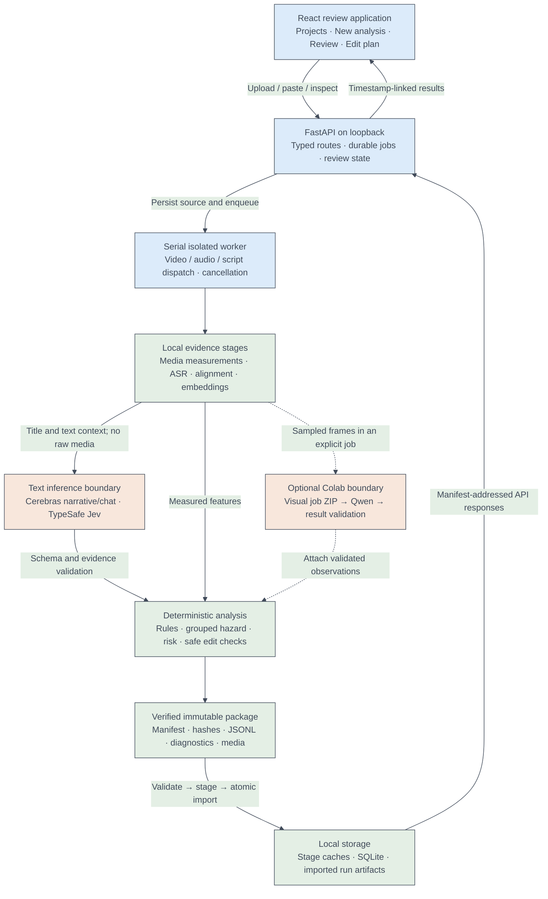
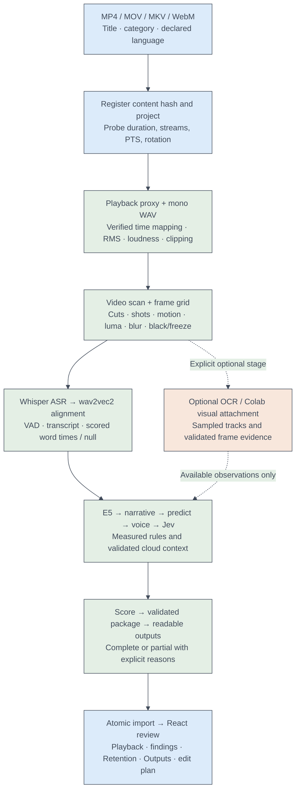
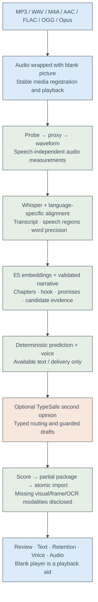
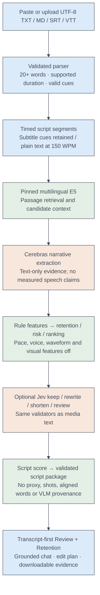

# Epoch 1.0 — evidence-grounded retention review

| Layer | Technology / pinned profile | What it does |
|---|---|---|
| Browser | React 19.2, TypeScript 5.9, Vite 7.1 | Project workflow, playback, timeline, retention breakdown, evidence review and exports |
| Navigation and state | React Router 7, TanStack Query 5, Zustand 5 | Routes, API/cache state, one shared playhead and selection |
| Charts and typography | Responsive SVG + Canvas, Inter, Source Serif 4, Noto Sans Devanagari | Inspectable charts, OCR overlays and readable English/Hindi text; no chart service |
| Local API | Python 3.11, FastAPI 0.135.1, Uvicorn 0.34, Pydantic 2.12.5 | Typed endpoints, job queue, validation, package import, review and recomputation |
| Persistence | SQLite, SQLAlchemy 2.0.48, immutable JSON/JSONL and ZIP artifacts | Project/run metadata, review state, verified artifacts and resumable stage records |
| Media | FFmpeg through imageio-ffmpeg 0.6, PyAV 15.1, OpenCV 4.11, SceneDetect 0.7.1, Pillow 11 | Probe, playback proxy, waveform/loudness, cuts, freeze/black checks and frame sampling |
| Speech | faster-whisper 1.2.1 / large-v3, CTranslate2 4.6, WhisperX 3.8.6 | Local CPU FP32 multilingual ASR and speech intervals |
| Alignment | PyTorch/torchaudio 2.8, Transformers 4.57.6; pinned English and Hindi wav2vec2 | Actual word times, with null times where alignment fails |
| Embeddings | sentence-transformers 5.1.2, multilingual-e5-base | Passage similarity and semantic retrieval in an isolated CPU environment |
| Grounded narrative | Cerebras via httpx 0.28.1; model selected by the configured service probe | Structured narrative extraction, candidate adjudication and grounded chat |
| Typed second opinion | TypeSafe System One, `jev-1.13.0` | Bounded keep/rewrite/shorten/needs-review routing with probability validation |
| Optional OCR | Paddle 3.3.1 / PaddleOCR 3.7, separate environment | Sampled on-screen text tracks and source-coordinate quadrilaterals |
| Optional visual AI | Pinned Qwen3.5-9B BF16 on Colab; 27B explicit alternate profile | Separate visual-job/result exchange; current real-model quality gate remains on hold |
| Numerical analysis | NumPy 2.2, SciPy 1.15, soundfile 0.13; pure Python prediction/scoring | Waveform pitch, measured delivery, deterministic features, hazard integration and ranking |
| Reproducibility | uv, per-environment hashed locks, pinned model manifests, pytest 8 | Dependency isolation, offline model inference, fingerprints and regression checks |
| Test media acquisition | yt-dlp, used as a transient local tool | Downloaded the two user-provided public clips for testing; not an app dependency or public URL ingestion feature |

Epoch helps creators inspect **where a video or script may lose attention, what evidence supports that concern, and what should be reviewed before editing**. It accepts video, audio or a script, constructs a timed evidence record, derives narrative and delivery signals, produces an assumption-based retention scenario, and presents timestamp-linked findings with counter-explanations.

The central prediction is **uncalibrated**. It is a transparent scenario built from engineering priors and available evidence, not YouTube audience analytics. No authentic audience-retention dataset has been used to fit its weights. A completed job can import a **partial analysis** package when optional modalities are missing; the UI preserves that distinction.

Current implementation: the integrated Kawal UI, durable browser upload worker, all three input pipelines, text-retention-v3, grounded chat, Jev second opinions, edit planning, export/import and a dedicated Retention section. See [the verification record](docs/FINAL_INTEGRATION_2026-10-03.md), [latest final checks](docs/FINAL_CHECKS_2026-10-03.md), [judge demonstration guide](docs/DEMO_GUIDE.md), and [detailed architecture and decision history](ARCHITECTURE.md).

## System architecture

These Mermaid diagrams use exactly four explicit colours throughout: soft blue `#DCEBFA` for interaction/orchestration, soft green `#E4EFE5` for local evidence/storage, soft peach `#F8E7DC` for external or optional inference, and slate `#414B5A` for text/lines. Spacing is deliberately generous. The overview is followed by pipeline diagrams and boundary details so one enormous graph does not obscure the system.



### Boundaries and ownership

| Boundary | Owns | Must not claim or do |
|---|---|---|
| React | Input preview, polling, display, selection, review actions | Does not invent evidence or compute authoritative cloud judgments |
| API | Typed validation, metadata, queue, importer, bounded artifact routes, server edit checks | Does not load Torch/Paddle in its process; does not accept arbitrary download paths |
| Media worker | The actual shared pipeline and export | Does not silently import failed stages or start multiple heavy upload analyses |
| ASR environment | Whisper, wav2vec2 and E5 subprocesses | Does not fabricate word precision for unaligned/interpolated words |
| Cerebras | Structure, bounded judgments, draft explanations | Cannot move precomputed candidate intervals, introduce unverifiable quotes or assert retention uplift |
| Jev | Typed editorial second opinion | Cannot mutate media, accept edits automatically or convert confidence into factual certainty |
| Optional Colab | Visual inference on explicit sampled clips | Cannot make an uninspected interval appear inspected; invalid/unpinned results are rejected |
| Deterministic validators | Schema, identities, intervals, evidence links, quotation and edit restrictions | Model output never overrides validation |

## Three complete input pipelines

### 1. Video: file to evidence-linked review



1. **Accept and persist.** `/api/v1/analyses` streams a supported file with a 2 GiB bound. An empty, unsupported or oversized file is rejected. The title/category/language is stored in a project; accepted sources persist in the job directory before the worker starts.
2. **Register and probe.** The source hash identifies content. A project-scoped workspace prevents identical media under different titles/projects from overwriting each other's reasoning. Probe records actual container duration, streams, rotation, frame timing and audio presence. The browser permits short/out-of-original-scope media; acceptance does not establish suitability for every genre.
3. **Prepare playback and audio.** Proxy video preserves the origin/time mapping for browser seeking. Audio extraction and FFmpeg measurements record waveform RMS, silence, loudness/peak and clipping diagnostics. Original media is retained locally in the package/output workflow.
4. **Scan actual frames.** Decode/source timestamps support cuts and shot boundaries, motion, luminance, blur proxy, black intervals, freeze intervals and gaps. A frame grid supports thumbnails, evidence and optional visual jobs. These measurements are not semantic understanding of a scene.
5. **Transcribe and align.** Whisper large-v3 runs CPU FP32 at six threads; VAD bounds speech regions. English/Hindi aligners are chosen by segment hints. Mixed segments use the Hindi route; Latin words may remain unaligned. Only scored aligned words retain times; failures keep segment timing and reduce precision. ASR loop artifacts are recorded/dropped by the guard.
6. **Create optional visual work.** Browser uploads prepare the visual job but do not run local Qwen or request new OCR. CLI OCR is opt-in. Existing valid cached OCR may be retained. A Colab result can be attached after independent validation; current Qwen quality qualification is on hold.
7. **Finish shared analysis.** Embeddings → narrative → prediction → voice → Jev → diagnostic score → export. Prediction uses only available inputs and computes optional voice windows directly from the extracted waveform when available. The later `voice` stage packages the dedicated Voice/Audio display diagnostics. Missing pitch analysis disables the corresponding feature without failing prediction.
8. **Validate and import.** Export validates its own manifest, tables and artifacts. The API validates again, checks project identity, stages files, and commits a SQLite transaction. The UI navigates to the immutable imported run. A completed job is different from full modality coverage.

### 2. Audio: recording to transcript and delivery review



The audio path deliberately reuses the media/time-origin machinery by wrapping the sound with a blank picture. It runs `probe`, `proxy`, `audio`, `asr`, `align` and shared finish stages. It does **not** run video scan, frame sampling or visual AI on the blank picture. No blank-video stagnation judgment is manufactured. The result carries text, speech and audio evidence, measured voice windows and a retention scenario; missing visual modalities make the general media package partial. A fresh 40-second English recording has already exercised this path through actual import.

### 3. Script: text to structural diagnosis before recording



The browser preview and Python parser share parsing semantics. Plain text is split into sentences/paragraphs, whitespace is normalised, and each segment gets at least one second at an estimated 150 WPM. SRT/VTT cues retain actual supplied cue times; duration is the **maximum cue end**, so overlapping/out-of-order cues cannot truncate the asset. Subtitle tags are removed; malformed/reversed cues are skipped with warnings. UTF-8 BOMs are supported. API validation requires at least 20 words and a 10-second to one-hour timeline.

`register_script` creates a content/project-scoped workspace and a script asset. The script stage supplies a timed transcript with an empty aligned-word table. Shared embeddings, narrative, prediction, Jev, score and export run against that source. Narrative version 15 suppresses measured WPM/filler-rate claims; export version 9 records user-script provenance. Voice/audio tabs are unavailable. A script can be complete relative to its required stages while speech/audio/visual coverage remains unknown. Estimates are planning aids, not a recording's delivery measurement.

## The retention engine: features, hazard and honest attribution

### What the v3 curve actually means

`pipeline/predict/features.py` constructs one feature dictionary per second from transcript, validated structure, and optional measured media. Values are clipped to `[0,1]` and scaled by actual overlap with each bin; the final fractional second is preserved. `pipeline/predict/model.py` then uses:

```text
h0_i = [H0(t_i + dt_i) - H0(t_i)] / dt_i
h_i  = h0_i × exp(sum of deduplicated log-hazard parts × scenario scale)
S_i  = S_(i-1) × exp(-h_i × dt_i), with S_0 = 1
AVD  = Σ S_(i-1) × [1 - exp(-h_i × dt_i)] / h_i
APV  = 100 × AVD / duration
```

The zero-hazard integral uses `S × dt`. Default anchors are 80% at 30 seconds and 45% at the end. They apply to a **neutral baseline**, not directly to the analysed video's curve. The baseline is Weibull-like, shape `k=0.6`, with an ending multiplier `1.5` over the final `5%`; it matches both anchors exactly for videos longer than 30 seconds. Clips of 30 seconds or less use the terminal anchor only: there is no observed 30-second point inside such a clip. Allowed advanced ranges are shape `0.3–1.0`, multiplier `1–3`, and end fraction `0–0.2`.

Each cause group contributes its strongest weighted active feature, rather than adding correlated symptoms. Groups are opening/promise, progress, comprehension, questions/payoff, interruptions, delivery and visual pacing. The questions/payoff group has no hazard features: lexical answer matching is review-only. If no positive risk part is active, only the strongest protective part is allowed, capped at `-0.1`. Signed micro-variation is a separate small adjustment. It can change pressure in both directions, but survival remains non-increasing.

The sensitivity band recomputes with all rule parts at `0.5×` and `1.5×`, taking the lower/upper survival. It is **not a statistical confidence interval**. Missing inputs switch their features off; they do not establish that those modalities are healthy. Calibration against real audiences remains unimplemented.

### Every hazard feature — input, trigger, effect and limitation

Every item below has four support points. Weights are log-hazard engineering priors before group deduplication, not trained coefficients or measured percentage-point effects.

#### Micro-variation — `+0.25`, signed

1. **Input:** local WPM versus speaker median, short-term loudness versus video's median, and cut timing, when available.
2. **Rule:** pace component `(median-local)/median`; loudness component `(median LUFS-local LUFS)/6`; cut component `-0.6` within two seconds of a cut and `+0.3` after eight seconds without one. Average available components, then apply a centred five-second mean and a ±0.02 dead zone.
3. **Effect:** `0.25 × (micro_slowdown - micro_pickup)` changes log hazard. No random waves or manually added undulations are used.
4. **Limit:** it measures relative variation, not excitement, editing quality or audience response. A slow demonstration or dramatic quiet passage can be intentional.

#### Setup before substance — `+0.60`

1. **Input:** narrative's validated hook end and first-substance timestamp.
2. **Rule:** setup starts after the hook; only a gap longer than 15 seconds activates the feature.
3. **Effect:** active setup raises opening/promise pressure; the group's strongest symptom wins.
4. **Limit:** extraction can miss implicit substance, visual delivery or prerequisites. The finding remains provisional and preserves necessary setup.

#### No hook identified yet — `+0.50`

1. **Input:** an available validated structure object and its hook timestamp.
2. **Rule:** active from time zero until the hook or 30 seconds; missing structure disables the feature rather than asserting no hook.
3. **Effect:** competes with other opening/promise features; the finding is emitted only for a meaningful opening interval of at least five seconds.
4. **Limit:** no detected hook is not proof of no hook. Visual or implicit hooks can be missed.

#### Payoff pending — `+0.50`

1. **Input:** separate title obligations, fulfilment status and first fulfilment timestamps.
2. **Rule:** a fulfilled/partial payoff must be later than both 45 seconds and 20% of duration; pressure ramps after 15 seconds. Unaddressed/uncertain promises contribute 0.5 after 60 seconds.
3. **Effect:** opening/promise pressure while delivery is pending; A3 findings quote the delivery passage.
4. **Limit:** preview differs from fulfilment, and deliberately delayed teaching/storytelling may be valid. Short clips do not automatically satisfy long-form timing triggers.

#### Low novelty — `+0.50`

1. **Input:** normalised content words in a centred 20-second window, compared with words preceding that window.
2. **Rule:** at least eight content words; after 30 seconds, novelty below 0.6 times the median after one minute, sustained for at least ten seconds. If later windows are absent, the reference median is 0.5.
3. **Effect:** scaled novelty deficit enters progress, deduplicated against repetition.
4. **Limit:** lexical novelty is not factual information gain. Explanations, examples and deliberate reinforcement may reuse vocabulary.

#### Repetition — `+0.70`

1. **Input:** content trigrams, prior wording, novelty and explicit recap/replay/advance cues.
2. **Rule:** at least two consecutive segments of six or more words; at least 50% prior trigram reuse and less than 25% new content words; no advance or recap marker, and no announced replay.
3. **Effect:** strongest progress rule when active; evidence includes both the current passage and best earlier passage.
4. **Limit:** paraphrase equivalence is not established by this rule. Useful examples and announced replays must be preserved; semantic similarity alone cannot authorise trimming.

#### Slow pace — `+0.40`

1. **Input:** at least 50 timed words, local speaking-time WPM in a 20-second window and the speaker's own median.
2. **Rule:** windows need at least eight words and more than four seconds of speaking span; activate below 0.8× median, scaling deficit over 0.3× median.
3. **Effect:** delivery pressure; exact word timings are required, so a plain script does not receive measured pace penalties.
4. **Limit:** slow explanations can improve understanding. WPM depends on tokenisation and alignment, especially in code-mixed speech.

#### Fast pace — `+0.30`

1. **Input:** the same aligned-word local WPM and speaker reference as slow pace.
2. **Rule:** activate above 1.2× median, scaling excess over 0.3× median.
3. **Effect:** a delivery candidate, deduplicated with other delivery symptoms.
4. **Limit:** a skilled audience or energetic genre may prefer fast delivery; the rule is relative, not an ideal universal speaking speed.

#### Filler density — `+0.30`

1. **Input:** an English filler lexicon matched against transcript segments; occurrences are placed at segment midpoints.
2. **Rule:** at least two occurrences within ±10 seconds; scale nominal fillers/minute by six and clamp.
3. **Effect:** delivery pressure and a review candidate, not an instruction to delete all discourse markers.
4. **Limit:** meaningful Hindi discourse words are excluded from blanket filler counting. Script lexical mentions do not become measured audio filler rates.

#### Dead air — `+1.00`

1. **Input:** waveform silence plus VAD, with RMS when available.
2. **Rule:** quiet gaps of at least two seconds; no-speech VAD alone is insufficient when music or other sound continues.
3. **Effect:** strongest nominal delivery penalty; candidates record the measured gap and preserve context around potential trims.
4. **Limit:** dramatic emphasis, demonstrations and visual-only content may justify silence. A quiet interval is a measurement, not proof of a bad edit.

#### CTA or sponsor — `+0.80`

1. **Input:** validated CTA/sponsor spans from narrative structure.
2. **Rule:** a span away from the last 45 seconds and before 85% duration is treated as an interruption; end-adjacent cues use the outro feature.
3. **Effect:** interruption pressure; a CTA before the first payoff gets a separately reviewable E1 finding.
4. **Limit:** sponsored segments can be relevant or contractually required. Required disclosures cannot be removed automatically.

#### Outro — `+0.60`

1. **Input:** closing spans or late CTA/recap spans.
2. **Rule:** an explicit outro, or ending-adjacent recap/CTA, activates ending pressure. An extended-outro finding needs duration greater than `max(20 seconds, 8% of video)`.
3. **Effect:** one interruption/ending group contribution. The model distinguishes an ending cue from the optional extended-outro finding.
4. **Limit:** a final synthesis and end-screen time can be valuable; transcript closing cues do not prove a visual end card.

#### Long sentences — `+0.20`

1. **Input:** punctuated transcript sentences and whitespace word counts.
2. **Rule:** longer than 30 words, with strength `(length-30)/20` clipped to one; punctuation must be present.
3. **Effect:** comprehension pressure; severity increases above 40 and 50 words, and directly countable longer cases receive stronger evidence status.
4. **Limit:** punctuation drift from ASR can invalidate sentence boundaries. Long sentences are not intrinsically incorrect; preserve technical meaning when splitting.

#### Long static shot — `+0.40`

1. **Input:** measured shot durations and motion scores, with at least four known motion measurements.
2. **Rule:** shot length beyond `max(8 seconds, 3× median shot length)` and motion at or below the within-video 25th percentile. Penalty starts after the threshold, increasing with overrun.
3. **Effect:** visual-pacing pressure; the finding retains the actual shot interval and motion/duration evidence.
4. **Limit:** diagrams, screen recordings and tutorials can be useful while static. Scene content requires review; sparse measurements cannot determine visual relevance.

#### Dense text with fast speech — `+0.30`

1. **Input:** OCR tracks of confidence at least 0.5, track text, dwell time and aligned speech rate.
2. **Rule:** at least 12 simultaneous on-screen words while local WPM exceeds 1.1× speaker median; strength scales by word count/24.
3. **Effect:** comprehension pressure, deduplicated with long-sentence pressure.
4. **Limit:** sampled OCR can miss text, misrecognise Hindi or duplicate overlays. Without OCR or word timing this feature is off, not clear.

#### Flat, low-energy delivery — `+0.20`

1. **Input:** at least four measured voice windows with voiced fraction ≥0.3 and pitch variation, plus valid speech loudness.
2. **Rule:** pitch standard deviation below 0.6× median and mean loudness below median by three dB, sustained for two adjacent ten-second windows.
3. **Effect:** a relative delivery feature when waveform pitch analysis succeeds during prediction.
4. **Limit:** waveform pitch is vulnerable to music, multiple speakers and noise. This is not emotion detection; prediction performs optional waveform analysis independently of the later display stage.

#### Sudden loudness drop — `+0.40`

1. **Input:** short-term LUFS and VAD speech flags, with at least 20 valid speech loudness samples overall.
2. **Rule:** speech continues, no dead-air feature, at least five preceding speech samples in ten seconds, and level falls ten dB below their median for at least three seconds.
3. **Effect:** delivery pressure linked to audible level change.
4. **Limit:** artistic level changes or speaker distance can be intentional. It is not a calibrated intelligibility or microphone-quality assessment.

#### Open-loop candidate — nominal `−0.40`

1. **Input:** validated viewer-question/open-loop spans.
2. **Rule:** a protective pulse decays linearly over 60 seconds after the span starts.
3. **Effect:** eligible only when no positive rule-group part is active; strongest protective part is capped at −0.1.
4. **Limit:** lexical question/answer candidates are separately review-only; an open question does not prove audience curiosity or a retention gain.

#### Concrete example or number — nominal `−0.20`

1. **Input:** transcript digits and explicit example markers such as “for example” or “imagine”.
2. **Rule:** mark the matching segment; overlap scaling controls each second's strength.
3. **Effect:** competes for the single capped protective contribution.
4. **Limit:** the detector does not verify that a number is true or an example is useful. English phrase coverage is incomplete for Hindi.

#### Fresh visual change — nominal `−0.15`

1. **Input:** measured shot starts after time zero.
2. **Rule:** three-second pulse, decaying from one at the cut.
3. **Effect:** single eligible protective part, capped and disabled while a risk group is active.
4. **Limit:** frequent cuts do not establish meaningful visual progress; no semantic value is inferred from a boundary alone.

#### New on-screen text — nominal `−0.15`

1. **Input:** OCR tracks, normalised text keys and track start/end times.
2. **Rule:** text confidence ≥0.5, length ≥3, appears after 500 ms, and more than five seconds after the same text was last seen; three-second pulse.
3. **Effect:** eligible protective text event; persistent watermarks/flicker do not continually earn protection.
4. **Limit:** OCR coverage is sampled. New text may be distracting or unreadable; existence does not establish usefulness.

#### Energy lift — nominal `−0.10`

1. **Input:** valid short-term loudness relative to this video's speech median.
2. **Rule:** at least four dB above the median for three consecutive seconds, restricted to speech when VAD exists.
3. **Effect:** a small eligible protective contribution; it does not cancel an active risk group.
4. **Limit:** louder does not mean better. No emotion, enthusiasm or optimal-volume claim follows from this rule.

### Drop windows, attribution and watch time

`loss` is the original-audience fraction leaving in the bin. `conditional_loss` is the share of the **currently remaining** audience leaving during the bin. The Retention view shows its actual duration, including a final fractional second. The separate departure-rate chart displays a five-point moving average of one-second equivalent leaving rates; its opening outliers can be axis-capped and that is disclosed in the chart caption. The new pressure chart is the uncapped ratio `h/h0`, so measured changes remain visible without fabricating a rising survival curve.

For excess attribution, the model compares the two hazards on the same remaining audience at the start of each bin:

```text
excess_i = S_(i-1) × [exp(-h0_i × dt_i) - exp(-h_i × dt_i)]  if h_i > h0_i
           0 otherwise
```

Positive parts share that excess proportionally. Cumulative feature totals are **not** the terminal survival difference and do not count observed real viewers. Ten-second windows are ranked by excess loss, spaced at least 15 seconds apart, with up to eight retained and linked to their dominant causes/quotes. AVD integrates survival continuously within each bin; APV uses actual video duration. Shortening can increase APV while reducing seconds watched, so comparisons report both.

## Review rules and candidate engines

There are separate deterministic findings, narrative candidates, lexical relation candidates, diagnostic risk and retention. A finding visible in review need not be scored into the hazard. The full code is in `pipeline/predict/evidence.py`, `pipeline/reasoning/candidates.py`, `pipeline/reasoning/relations.py`, `pipeline/predict/risk.py` and `pipeline/scoring/`.

| Finding rule | Input / exact policy | What review receives | Retention relationship |
|---|---|---|---|
| A1 Long preamble | Post-hook setup >15 s | Duration, substance timestamp, preserved setup | Scored setup feature |
| A2 Hook not identified | Available structure, ≥5 s opening interval | Detector limitation and opening quote | Scored no-hook interval |
| A3 Late payoff | >45 s **and** >20% duration; high severity >90 s and >35% | Obligation, first delivery quote, absolute/relative delay | Scored pending-payoff feature |
| A4 Unconfirmed promise | Title obligation lacks confirmed delivery | Missing/uncertain status for manual confirmation | Review-only semantic candidate |
| B1 Repeated passage | Two consecutive reused segments, trigram/novelty checks, replay guard | Both quotes, reused fraction, preservation instruction | Scored repetition |
| B2 Low novelty | Sustained window deficit | Novelty values and contextual alternative | Scored lexical novelty |
| B3 Possible detour | Narrative tangent span with no explicit link back in span/next 15 s | Quote and potential prerequisite explanation | Review-only relation/structure candidate |
| C1 Long sentence | Punctuated >30 words | Word count, safer splitting suggestion | Scored comprehension |
| C2 Term before definition | Named-phrase definition detector finds later explanation | First use, later candidate definition, gap | Review-only; detector is lexical |
| C3 Dense new terms | High load window + long sentences/mean ≥22 words + no concrete marker | New terms, sentence count and missing example cue | Review-only, no semantic overload verdict |
| C4 Abstract stretch | ≥40 s of abstract terms without a detected example/number | Terms, duration, passage, counter-explanation | Review-only |
| D1 Question callback | ≥4-word question, ≥2 content terms; later lexical overlap candidate, gap >60 s or no match | Asked/answer-candidate quotes and uncertainty | Review-only; no invented unanswered-question penalty |
| D2 Stacked questions | ≥2 recent questions within 60 s while earlier callbacks remain open | Question count and intervals | Review-only |
| E1 Early CTA | CTA before first title payoff | CTA span, payoff position, preserve disclosures | Interruptions feature, no duplicate additive penalty |
| E2 Sponsor/interruption | Narrative sponsor/CTA away from ending | Placement, safe bridge suggestion | Interruptions feature |
| E3 Extended ending | >max(20 s, 8% duration) | Closing duration, preserve takeaway/end-screen | Outro feature |
| E4 Redundant recap | ≥50% prior trigram reuse, <25% new terms | Earlier quote, reuse and novelty values | Reviewable recap; intentional reinforcement is preserved |
| V1/V2 Relative pace | Aligned local WPM <0.8× / >1.2× speaker median | Window and median values | Scored delivery feature |
| V3 Filler cluster | Bounded lexicon occurrences in 20 s | Words/count, language-aware caveat | Scored delivery feature |
| V4 Quiet gap | Waveform + no-speech evidence, ≥2 s | RMS/silence evidence and intentional-pause alternative | Scored dead-air feature |
| Measured media findings | Static shot, dense text/fast speech, level drop, flat quiet delivery | Underlying relative measurements and available coverage | Only corresponding available features are scored |

For **each** rule, the application follows four shared checks: (1) construct an interval and supporting measurement/quote; (2) verify bounds and evidence references; (3) give mechanism, concrete suggestion, counter-explanation and what must be preserved; (4) keep uncertainty/reanalysis requirements and creator review authority. “Supported” describes direct measurement, such as phrase reuse or waveform silence; it does not validate a predicted audience effect. Narrative/lexical interpretation remains provisional.

### Narrative candidate retrieval and adjudication

The older candidate builder uses retrieval thresholds distinct from v3 hazard features: quiet gaps ≥2 s, intro retrieval >20 s, payoff retrieval >60 s, and static-shot retrieval >15 s. Caps per candidate type bound the reasoning context (for example six dead-air/repetition/static candidates, three rushed/CTA/audio candidates, four visual-fault/tangent candidates). These are **retrieval policies**, not interchangeable global retention thresholds.

1. Deterministic code builds fixed intervals, evidence IDs and legal edit options. It can snap edit boundaries to actual sentence-ending aligned words; unsupported boundaries retain lower precision.
2. Cerebras extracts structure, then adjudicates candidates using numbered evidence/options. It supplies prose and a choice, not freely generated timestamps or risk values.
3. Validators reject unknown evidence, non-substring quotations, invalid intervals and unapproved options. E-01 requires actual earlier support before calling a passage redundant; E-02 protects announced replays used as demonstrations.
4. Accepted and dismissed candidates retain context/counter-explanations. Move, rewrite, insert and context-sensitive edits require reanalysis rather than an invented uplift score.

### Risk, priority and the older scenario

The **heuristic transcript risk** uses five-second bins, severity `(1/3, 2/3, 1)` and evidence weight `(supported=1, provisional=0.5)`, multiplied by overlap fraction. The strongest finding per cause group wins, then group weights sum: opening .22, progress .18, comprehension .18, questions .08, interruptions .09, delivery .13, visual pacing .12. This is an ordinal review score, not an abandonment probability.

Editorial priority weighs evidence .30, severity .25, safe edit .15, duration .10 (saturates at 30 s), title relevance .10 and misunderstanding risk .10. Mostly overlapping same-group lower-priority candidates are down-weighted by .5. Priority is not the steepest curve drop.

The older **multimodal diagnostic scoring** separately combines narrative .30, visual .25, pacing .20, text .15 and technical .10. Within a track/cause group it uses maxima to avoid duplicate penalties. Coverage unions observed spans; bounds are `lower=c×risk`, `upper=c×risk+(1-c)`. Unknown coverage widens the bounds instead of adding zero risk. Its central scenario requires complete coverage and at least 60 seconds; hazard is `h0 + (kappa/T)×risk`. The newer v3 available-feature scenario can exist while this older combined scenario is unavailable. Both are labelled, not silently conflated.

## Jev routes and guarded recommendations

Jev is integrated in two places:

- **Pipeline stage:** `pipeline/reasoning/jev.py` version 6 runs after transcript/script preparation and shared finish stages. It writes `jev.json`, preserved in packaged diagnostics and surfaced by `/deepdive` / Text review.
- **On-demand endpoint:** `POST /api/v1/runs/{run_id}/jev-review` accepts a question up to 2,000 characters and an optional in-run interval. Selection gets ±20 seconds of adjacent transcript context. The route applies the same typed judgment and announced-replay guard. It returns second opinions; it does not apply media edits. The generic chat path is a separate grounded Cerebras endpoint, not a hidden Jev alias.

Routing is explicit:

1. `TYPESAFE_API_KEY` missing → `not_configured`, no invented decisions. Requests use `https://api.typesafe.ai/v1/systemone` and pinned `jev-1.13.0`.
2. Shared batches contain up to 12 passages and 40,000 text characters. An oversize passage or more than eight required calls returns unknown rather than silent truncation. Questions are limited to **keep**, **rewrite**, **shorten**, **needs_review**.
3. Responses must have exactly the requested passage IDs; finite confidence/probabilities within `[0,1]`; exactly all four option probabilities summing to one within .02; selected choice consistent with the maximum probability. Invalid/network results are unavailable/partial. There is no automatic HTTP retry.
4. Confidence below **65%** routes to `needs_review`, retaining raw choice. Confidence is model confidence, not measured editorial correctness. Complete decisions cache by title, chunks, question, model and rubric; a cache hit is disclosed.
5. Announced replays route actionable rewrite/shorten decisions back to review. The pipeline may ask Cerebras for explanations/drafts, but shortening requires an earlier passage, at least four verbatim supporting words, and a draft with fewer words. Invalid support or non-shorter drafts are removed and routed to review. A valid draft still requires creator review.

Only title/transcript/question context is sent to TypeSafe. Jev does not see raw video/audio. Cerebras receives title, transcript, measurements and available visual notes for its relevant operations; the application disclosures explain this. Raw API keys are not packaged or shown. Configuration and real service availability are separate facts; the verification report records the live result for each tested run.

## Application surfaces and how they connect

| Surface | What it does | Data and interactions |
|---|---|---|
| Projects | Lists saved titles, run history, current status and scenario summaries | SQLite metadata + imported run summaries; resume preserves project settings |
| New analysis | Three steps: choose source, preview/input, title/category/language/audience | Actual upload/paste APIs, job status, polling, cancel/retry; ZIP package import remains separate |
| Overview | Summary, structure, risk, findings and available measurements | Available prediction plus timeline/narrative, clearly labelled estimates |
| Retention | Dedicated survival, pressure undulations, departure rate, selected-bin causes, ranked drops, cumulative watch time and assumptions | `prediction` per-second bins; clicks use the shared playhead and interval selection |
| Text | Transcript, promise/structure relations, findings and Jev second opinions | Timed text, word precision, lexical candidates and packaged Jev diagnostics |
| Voice | Measured WPM and waveform pitch/variation windows | Media only; null/unmeasured pitch remains unknown; not emotion recognition |
| Audio | Loudness, RMS, silence and waveform diagnostics | Actual audio measurements; no music/sound-effect identification claim |
| At this moment | Connects current playback position to local passage, chapter and finding | One Zustand selection model shared by video, words, charts and citations |
| Findings drawer | Evidence, mechanism, suggestion, counter-explanation and preservation requirements | Exact issue/evidence IDs; accept/dismiss writes review state without changing original media |
| Outputs | Manifest-listed artifacts, previews, package/file downloads, shots, OCR stills and run details | Artifact-ID routes, range-capable media; OCR quads mapped from source pixels to the selected still |
| Edit plan | Non-destructive proposed operations and hypothetical comparison | Validated cuts/resolved assumptions; moves/rewrites/inserts require new analysis |
| Assistant | Answers questions from the current run, with timestamp citations | Hybrid local retrieval + bounded cloud context + server quote/edit validation |
| Evaluation | Run coverage, provenance and reviewed-candidate statistics | Does not display invented WER, retention accuracy or editorial benchmark scores |
| Settings | Data location, installed pinned models and cloud configuration | Local diagnostics and service disclosures; no credential values displayed |

The light UI uses serif headings and compact sans-serif controls, with Devanagari font support. Labels use readable sentence case; raw evidence quotations remain unchanged so source validation is meaningful. Responsive SVG charts derive coordinates from container width; missing measurements are hatched or stated. Survival points are actual bin edges, not a decorative spline that can overshoot. New run navigation clears prior scenario/selection state so one video's assumptions do not leak into another review.

## Grounded retrieval, chat and edit safety

`TranscriptIndex` makes sliding three-segment passages, normalises Unicode/word forms, and ranks lexical matches using BM25 (`k1=1.4`, `b=.75`) plus small creator-vocabulary expansions. An available pinned multilingual E5 encoder supplies dense scores from the isolated ASR environment. Reciprocal rank fusion uses `1/(60+rank)` for lexical/dense rankings, with a bounded selected-location prior; overlapping duplicate passages are suppressed and retrieved context returned in timeline order.

Corpus vectors are keyed by model-manifest digest and transcript text; query scores have a bounded in-process cache. Encoding is locked, runs at lower priority and has a timeout. If the encoder is unavailable, lexical retrieval remains available with an explicit fallback label. Similarity scores are retrieval signals, not correctness probabilities.

The API sends the relevant retrieved transcript passages, findings, chapters, scenario and available measured voice/audio to Cerebras. Returned citations and quotes are checked against the supplied sources. Edit-oriented answers include server-side context/reanalysis warnings. Suggested changes remain separate from source text. A chat answer cannot remove a contractual disclosure, invent a factual quote, apply an edit or guarantee retention improvement.

Hypothetical comparison merges/clamps cuts, maps issue/coverage intervals into the retained timeline, explicitly lists assumed-resolved issues, and recomputes both sides with the same assumptions. Coverage reconstructed from stored bins is approximate within partially covered bins. Rewrites/moves/new visuals/audio fixes are not simulated; a newly rendered source must be uploaded as a new run. No video rendering or NLE export is implemented.

## Runtime, storage and reproducibility

### Durable local jobs

`AnalysisJobs` persists `job.json`, `request.json`, source and result per UUID under `app/analysis_jobs/`. A single worker thread launches one isolated media child process at a time with `nice -n 10` on macOS and six ASR threads. Structured progress events record stages and a bounded log tail. Only complete/partial stage records continue to export; failed jobs do not import a run. The validated package must match the job's project before commit.

Cancellation and import are protected by a lock so cancellation cannot race a validated package commit. Active children use process groups and are terminated on cancellation/shutdown. A restart marks interrupted queued/running work failed; it does not silently repeat expensive/cloud operations. A deliberate retry can reuse valid stage caches. This design assumes **one local API process**, not multiple Uvicorn workers or distributed scheduling.

### Stage fingerprints

A fingerprint covers stage name/version, schema, relevant config, extra inputs such as title/prompts/model revisions, environment lock digest and upstream output digests. Completed artifacts live under `stages/<name>/<fingerprint16>/`; partial work uses `.partial`, the journal is append-only, and `current.json` selects current finished stage records. Changing a relevant input creates a new fingerprint. Existing artifacts are not relabelled.

The data root defaults to sibling `../epoch-data`, configurable through `EPOCH_DATA_DIR`. The repository contains source, contracts, prompts, lockfiles and tests; downloaded inputs, model snapshots, caches, packages and credentials are not committed. Export provenance records actual source revision/working-tree state and dependency/model identities. A run generated from a dirty checkout is not called a clean-commit release artifact.

### Time, identities and packages

All intervals are half-open `[start_ms,end_ms)` with container time zero. Frame references use actual PTS/time base, not frame index divided by an average frame rate. Word precision is retained only when alignment scores support it. Stable record UUIDs derive from source/run keys; content hashes verify files. Some exported runtime/provenance metadata can change package identity between analyses; import idempotency applies to identical package bytes, not a promise that every rerun has byte-identical ZIP output.

The package contains a manifest, JSONL entities, evidence/coverage, diagnostics, media and readable outputs. Manifest hashes, record references, intervals and path safety are validated. Duplicate package bytes return the existing import/run; conflicting bytes for an existing immutable run ID are rejected. Import stages files before an atomic metadata transaction. Artifact previews/downloads resolve IDs through the manifest and run root. Nested visual-job ZIPs are download artifacts, not recursively trusted extraction inputs.

### Why the environments are separate

- `media`: PyAV/OpenCV/FFmpeg/NumPy/scoring controller. One OpenCV wheel avoids conflicting `cv2` providers.
- `asr`: Torch, WhisperX, CTranslate2, wav2vec2, E5. `setuptools<81` preserves the currently required `pkg_resources` import. FP32 local inference follows the pinned profile.
- `ocr`: Paddle/PaddleOCR, opt-in because CPU OCR is costly and should not compete with ASR.
- `api`: FastAPI/SQLAlchemy/Pydantic, without Torch/Paddle; recomputation uses pure Python.
- `vlm`: Colab GPU profile with a separate lock and placement/memory gates. It is not a local browser background model.

Model repository revisions are pinned in `pipeline/model_registry.py`: Whisper `edaa852…`, English aligner `22aad52…`, Hindi aligner `062f7f5…`, multilingual E5 `d128750…`; full digests/manifests are recorded in provenance. Model setup verifies snapshots before offline inference.

## Technical decisions and tradeoffs

| Decision | Reason / integration consequence | Current boundary |
|---|---|---|
| Local media + cloud text reasoning | Large files stay local; cloud handles small structured text context | Cloud text can still include private transcript content; disclosures remain visible |
| One heavy upload worker | Fits laptop RAM/CPU and prevents ASR/OCR collisions | No distributed queue or multi-user service guarantee |
| Shared finish stages for three inputs | Same evidence, prediction, Jev and package contract | Source-kind gates prevent missing media from becoming fake measurements |
| Script timeline at 150 WPM | Provides a review timeline before recording | Estimated duration, not measured delivery |
| Null unaligned word times | Honest precision and safer edit boundaries | Some mixed-language words cannot support precise cuts |
| Group maxima and capped protection | Reduces double-counting of correlated symptoms | Weights remain priors, not empirical effect sizes |
| Weibull baseline and exact integral | Curved neutral profile, stable anchors and fractional-bin watch-time correctness | Shape reflects an assumption, not audience data |
| Measured micro-variation | Gives interpretable changing pressure without random visual texture | Relative pacing/loudness/cut changes do not establish engagement |
| Separate risk / retention / priority | Prevents an ordinal finding score from masquerading as a probability | More concepts to explain; labels and dedicated breakdown clarify them |
| Typed Jev with .65 gate | Bounded options and invalid-response rejection | Confidence itself has no human-reference calibration |
| Keep model output behind validators | Evidence/quote/time/edit authority remains deterministic | Validators cannot establish all semantic truth |
| BM25 + E5 rank fusion | English/Hindi-capable retrieval with lexical fallback | Not a universal multilingual editorial benchmark |
| Immutable package exchange | Reproducible inspection, offline review and explicit lineage | Packages can be large and include original media; treat them accordingly |
| Optional OCR | Retains measured text without blocking every upload | Fresh browser uploads do not request it |
| Colab-only visual AI | BF16 GPU inference is separate from limited local resources | Real-model result quality remains on hold; not advertised as complete |
| Custom SVG/Canvas | Lightweight shared time/selection model and precise chart labels | No third-party charting service; accessibility relies on accompanying text controls |
| Non-destructive edit plan | Preserves source and makes assumptions reviewable | No automatic editor/rendered before-after output |
| Loopback runtime | Supports a contained local demonstration | Authentication, deployment and hosted multi-user security are not implemented |

Historical planner decisions D01–D18 and implementation changes are preserved in [ARCHITECTURE.md](ARCHITECTURE.md) and [PLANNER/DesignDecisions.md](PLANNER/DesignDecisions.md). Those documents contain historical evidence; the current status below takes precedence over older “not run” snapshots.

## Feature inventory: built, partial and absent

“Built” means an implemented path, not validated audience impact. Optional visual semantic features remain unqualified until the visual quality gate passes.

| IDs | Analysis | Current implementation / boundary |
|---|---|---|
| F01, F04 | Hard cuts, shot duration | Measured scan and shot inspector |
| F02, F03 | Dissolve/wipe and jump-cut taxonomy | Dedicated classification absent |
| F05 | Scene versus shot | Shots distinct from inferred topic chapters; semantic scene grouping partial |
| F06, F07 | Black and freeze/static | Measured intervals/motion, with contextual review |
| F08–F10, F12 | Zoom, pan, shake, speed ramps | Dedicated detectors absent |
| F11 | Motion energy | Per-shot motion measurements |
| F13 | Angle/shot type | Optional visual labels, on hold/unqualified |
| F14–F16 | Captions, title cards, lower thirds | OCR tracks measured on earlier English video; role/correspondence semantics partial |
| F17–F19 | Stickers, arrows, PIP | No dependable inventory; optional visual observations on hold |
| F20, F21 | Progress cues, watermarks | OCR text persistence available; semantic role/brand recognition not qualified |
| F22 | Text density | OCR tracks + aligned pace feature when present; sampled coverage |
| F23 | Brightness | Per-shot luminance diagnostics |
| F24, F25 | Saturation/colour jumps | Dedicated analysis absent |
| F26 | Blur | Laplacian proxy; not calibrated visual quality |
| F27, F28 | General VQA / human gaze | Absent; no eye-attention inference |
| F29–F37 | Clutter, faces/size/contact/emotion, gestures, person count, A/B-roll, screen recording | Optional coarse visual code exists for some labels; dedicated trackers and qualified semantic analysis absent |
| F38, F39 | Speech and silence | VAD + waveform-aware quiet gaps |
| F40 | Speech rate | Aligned-word relative WPM for media; no measured script pace |
| F41 | Loudness/energy | Integrated/short-term loudness, peak and RMS |
| F42 | Pitch variation | Waveform autocorrelation windows implemented; analytics, not emotion or calibrated prosody |
| F43–F45 | Music, sound effects, beat sync | Dedicated acoustic classification absent |
| F46 | Audio quality | Clipping/peak diagnostics; noise/intelligibility model absent |
| F47 | Language hints/switches | Transcript hints and English/Hindi alignment; fresh Hindi clips exercised, broad Hinglish benchmark absent |
| F48, F49 | Hook and title payoff | Validated narrative plus distinct obligations and fulfilment intervals |
| F50 | Repetition | Lexical measured rule, embedding candidates, contextual adjudication; no guaranteed paraphrase detector |
| F51, F52 | Tangents and fillers | Provisional contextual tangent review; bounded language-aware filler lexicon |
| F53, F54 | Questions and loops | Structural spans + lexical callback candidates; semantic missing-answer truth not established |
| F55, F62 | CTA/sponsor | Separate spans, placement/duration and preservation requirements |
| F56 | Information density | Lexical novelty/new-term/load heuristics; not factual claim counting |
| F57 | Sentiment/energy wording | No sentiment-to-retention scoring |
| F58, F59 | Cold open, greeting and substance | Transcript structure; visual cold-open context may be missing |
| F60 | Logo sting | Dedicated semantic visual detection absent |
| F61 | Chapters | Inferred narrative chapters and bounded timeline |
| F63, F64 | Recap and outro | Text roles/replay protection; visual end-card analysis unqualified |
| X01, X02, X07 | Coverage, promise ledger, intro/payoff timeline | Built; missing modalities explicit |
| X03 | Modality agreement | General cross-modal semantic contradiction verification absent |
| X04 | Useful static visual | Counter-explanations and measured shot context; semantic usefulness partial |
| X05 | Text dwell/occlusion | Track dwell available; occlusion/readability verification absent |
| X06 | Prerequisite continuity | Quote/replay/edit guards built; full entity dependency graph absent |
| X08, X09 | Risk/retention and counter-explanations | Built, independently labelled |
| X10 | Action plan / before-after | Plan + hypothetical cuts built; actual rendered/reanalysed comparison requires manual new upload |
| X11, X12 | Grounded assistant / resumable package loop | Built with retrieval labels, citations, checkpoints and imports |
| X13 | Evaluation/provenance | Coverage/review/provenance built; real retention overlay and frozen labelled evaluation absent |

Additional absent product capabilities: hosted authentication, team collaboration, billing, direct public-URL ingestion in the app, background music/sound separation, video editing/rendering, guaranteed Windows qualification of the new browser worker, universal genre support, retention uplift guarantees and complete Hindi semantic-rule coverage. Hindi recognition/alignment is separate from English-heavy lexical relation rules. Fresh short/trailer tests exercise transport and inference paths; they are outside the original 5–15 minute educational/tech focus and do not qualify those genres scientifically.

## Run locally

Requires Python 3.11, uv, Node 20+ and room for pinned model snapshots/work artifacts. macOS was exercised; original hashed locks target Windows, and platform-specific Mac locks are selected by stage provenance when present.

### macOS setup

```sh
# From repository root. Use existing locks/*.mac.txt when available.
for env in media api asr; do
  uv venv --python 3.11 .venvs/$env
  uv pip sync --python .venvs/$env/bin/python --require-hashes locks/$env.mac.txt
  uv pip install --python .venvs/$env/bin/python --no-deps -e .
done
.venvs/asr/bin/python scripts/setup_models.py asr align_en align_hi embed
```

If Mac locks are absent, compile new platform locks from `requirements/<env>.in` with `uv pip compile --generate-hashes`, then sync. Do not overwrite Windows locks. Configure a git-ignored `.env` with `CEREBRAS_API_KEY`, optional `TYPESAFE_API_KEY`, and `EPOCH_ASR_THREADS=6`; optionally `EPOCH_DATA_DIR`. Never commit credentials. Required model/service configuration failures are surfaced as such, rather than replaced by fabricated results.

```sh
# Terminal 1: API + durable worker; one process only
.venvs/api/bin/python -m uvicorn apps.api.main:app --host 127.0.0.1 --port 8765
# Terminal 2: frontend dev server, proxying /api to 8765
cd apps/web
npm ci
npm run dev
# Open http://127.0.0.1:5173
```

For a built demo, run `npm run build` from `apps/web`; the API serves `dist` at `http://127.0.0.1:8765`. No separate frontend server is needed in that mode. Health is `/api/v1/health` (not `/api/health`). The app supports uploading files/pasting text; yt-dlp was a local test acquisition tool, not a hidden upload URL route. FFmpeg/PyAV/soundfile are the implemented media stack; pydub is not required or integrated.

### Windows setup

```sh
bash scripts/setup_envs.sh media api asr
.venvs/asr/Scripts/python.exe scripts/setup_models.py asr align_en align_hi embed
# Configure .env locally, then:
.venvs/api/Scripts/python.exe -m uvicorn apps.api.main:app --host 127.0.0.1 --port 8765
# Separate terminal, apps/web: npm ci && npm run dev
```

These are the intended cross-platform commands. The new upload worker's current live evidence is macOS; do not interpret documentation as a completed fresh Windows test.

### CLI and optional visual loop

```sh
.venvs/media/bin/python -m pipeline.cli analyze /path/video.mp4 --title "Exact title" --category education --language en
.venvs/media/bin/python -m pipeline.cli status <asset-prefix>
.venvs/media/bin/python -m pipeline.cli finish <asset-prefix>
.venvs/media/bin/python -m pipeline.cli outputs <asset-prefix>
.venvs/media/bin/python -m pipeline.cli transcribe /path/audio.wav --language hi --allow-out-of-scope
# Optional OCR: analyze ... --with-ocr
# Optional Colab: transfer visual job, run qualified profile, then attach-visual and finish.
```

Read [COLAB_RUN.md](COLAB_RUN.md) before the separate GPU loop. Visual jobs use 20-second clips with context, frame/token bounds, pinned weights and a placement verifier. The runner has bounded JSON repair/OOM handling and failure-stop policies; tests of code/processor shape are not proof of real Qwen output quality. Existing real-profile evidence is insufficient and the gate remains on hold.

## API map

| Route | Purpose |
|---|---|
| `GET /api/v1/health` | Local readiness of the API process |
| `GET/POST /api/v1/projects` | Saved projects and metadata |
| `GET /projects/{id}/analysis-request`, `/pipeline` | Resume context and stage status |
| `POST /api/v1/analyses` | Multipart video/audio/script upload |
| `POST /api/v1/analyses/text` | Pasted script JSON |
| `GET /api/v1/jobs/{id}`, `POST /api/v1/jobs/{id}/cancel` | Durable analysis status and cancellation |
| `POST /api/v1/imports`, `/imports/local` | Validated package import |
| `GET /api/v1/runs/{id}` | Immutable run metadata, missing stages and coverage |
| Run `/transcript`, `/timeline`, `/shots`, `/ocr`, `/relations`, `/deepdive` | Time-linked evidence and available diagnostics |
| Run `GET /prediction`, `POST /prediction` | v3 scenario and acknowledged assumption recomputation |
| Run `/jev-review` | Bounded on-demand Jev second opinion |
| Run `/issues`, `/evidence/{id}`, issue `/review` | Findings, exact evidence and creator review state |
| Run `/chat` | Grounded assistant |
| Run `/outputs`, `/artifacts/{id}`, `/outputs.zip`, `/transcript.srt`, `/transcript.vtt` | Bounded previews and exports; the ZIP download contains run outputs; package files are manifest-listed artifacts |
| Run edit-plan / hypothetical routes | Non-destructive planning and same-assumption comparisons |
| `/api/v1/evaluation`, `/settings` | Diagnostics, provenance and configuration |

Where shorthand paths are used, they are under `/api/v1/runs/{id}`. Use the live `/openapi.json` for exact methods/schemas; not all read routes accept writes. The OCR endpoint bounds filtering parameters and normalises only quads belonging to the selected frame, using source/crop dimensions. It never overlays other timestamps' boxes on a still.

## Verification and limits

```sh
.venvs/media/bin/python -m pytest --ignore=tests/test_api.py --ignore=tests/test_predict_api.py --ignore=tests/test_analysis_api.py --ignore=tests/test_vlm_codepath.py
.venvs/api/bin/python -m pytest tests/test_api.py tests/test_predict_api.py tests/test_analysis_api.py
# apps/web:
npm run build
# repository root:
git diff --check
```

Regression coverage includes anchors, fractional bins, exact watch time, measured signed variation, missing-modality behavior, rule deduplication, script-only provenance, Jev typed routing/replay/shortening guards, import hash/path safety, worker cancellation and project identity. The optional local VLM test uses tiny random weights and is separate from live GPU qualification. See the dated reports for counts and actual imported run IDs rather than treating a passing suite as audience-validation evidence.

The local English video/audio/script paths have actual run evidence. Both newly supplied Hindi videos completed fresh runs and are recorded in the final report with exact duration, ASR/alignment state, Jev status and missing stages. Downloaded media/model caches stay outside Git. Broad Hindi/Hinglish transcription quality, Hindi semantic rules, audience prediction accuracy, full visual inference, long-duration stress and production deployment remain unqualified.

## Source map and documentation

| Path | Authority / responsibility |
|---|---|
| `contracts/` | Enumerations, record invariants, package validation |
| `pipeline/orchestration/` | Workspaces, environment isolation, fingerprints and stage execution |
| `pipeline/media/`, `pipeline/speech/`, `pipeline/script/` | Source-specific extraction and timing |
| `pipeline/reasoning/` | Embedding, narrative, candidates, relations, Jev and retrieval |
| `pipeline/predict/` | v3 features, hazard, evidence, risk/ranking and view contract |
| `pipeline/scoring/` | Coverage-bounded diagnostic risk, older scenarios and hypothetical edits |
| `pipeline/package_export.py`, `pipeline/outputs.py` | Verified exchange package and readable reports |
| `apps/api/` | Queue, import, persistence and review endpoints |
| `apps/web/` | React input/review/demo UI |
| `epoch_vlm/`, `notebooks/`, `COLAB_RUN.md` | Separate optional visual runtime and qualification |
| `tests/`, `fixtures/` | Regression evidence and generated deterministic packages |
| `requirements/`, `locks/`, `scripts/` | Pinned environments and model setup |
| `PLANNER/` | Original requirements, roadmap and decisions; planned features are not automatically implemented |
| `docs/FINAL_CHECKS_2026-10-03.md`, `docs/DEMO_GUIDE.md` | Latest verification evidence and presentation flow |

For judges: lead with the evidence-linked editing workflow, demonstrate all three inputs using already completed runs, show the dedicated retention breakdown and a timestamp-linked finding, then explain typed Jev routing and the validator boundary. Call the percentages **scenarios**, explain APV together with AVD, and show missing coverage rather than promising unsupported accuracy.
